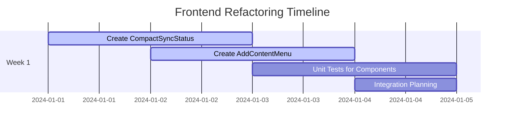
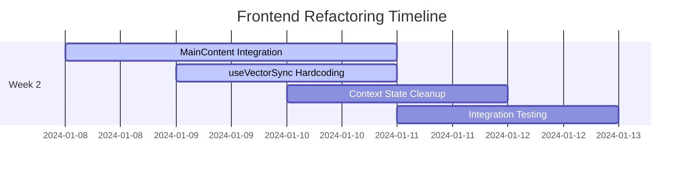
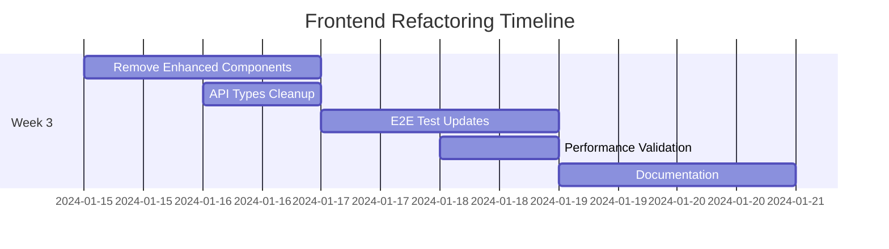

# Comprehensive Plan: Frontend Refactoring - Enhanced RAG Simplification

## Executive Summary

### Objective
Transform the Enhanced RAG Frontend from a complex, feature-heavy interface to a streamlined, default-driven experience that prioritizes usability while preserving backend flexibility.

### Strategic Vision
- **Simplification over Configuration**: Remove complex UI settings that confuse users
- **Proven Defaults**: Hard-code optimal strategies (`markdown_intelligent`) for 95% of use cases
- **Backend Agnostic**: Maintain full API flexibility for power users and integrations
- **User-Centric Design**: Focus on content management, not configuration management

### Business Impact
- **30%+ reduction** in frontend complexity (lines of code, components, state management)
- **Improved UX**: Fewer decisions, faster onboarding, better defaults
- **Reduced support burden**: Less configuration confusion
- **Maintained flexibility**: Backend API unchanged for direct integrations

## Technical Analysis

### Current Architecture Assessment

#### 🔍 Frontend Component Analysis
```typescript
// Current Complex Architecture (BEFORE):
├── MainContent.tsx (217 lines)
│   ├── EnhancedCollectionSyncStatus (detailed status display)
│   ├── CollectionSyncButton (duplicate sync functionality)
│   ├── EnhancedSettingsModal (542 lines - TO BE REMOVED)
│   └── Multiple separate Add buttons (visual clutter)
│
├── Enhanced Settings Architecture:
│   ├── EnhancedSettingsPanel.tsx (542 lines) ❌ REMOVE
│   ├── EnhancedSettingsModal.tsx ❌ REMOVE
│   ├── Complex state management in useVectorSync.ts
│   └── Non-persistent settings (lost on reload)
│
└── API Integration:
    ├── Optional chunking_strategy in SyncCollectionRequest
    ├── Complex enhanced features in RAGQueryRequest
    └── Multiple UI controls for backend flexibility
```

```typescript
// Target Simplified Architecture (AFTER):
├── MainContent.tsx (streamlined)
│   ├── CompactSyncStatus (emoji indicators) ✅ NEW
│   ├── AddContentMenu (consolidated plus menu) ✅ NEW
│   └── Essential controls only
│
├── Hardcoded Strategy Integration:
│   ├── useVectorSync.ts (markdown_intelligent hardcoded)
│   ├── Removed settings persistence complexity
│   └── Default chunk_size: 1000, chunk_overlap: 200
│
└── Backend Compatibility:
    ├── API unchanged (markdown_intelligent, baseline, auto)
    ├── Direct API users unaffected
    └── Future re-addition of UI controls possible
```

#### 🏗️ Backend Integration Points

**API Endpoints (UNCHANGED)**:
```python
# Vector Sync API remains fully functional
POST /api/vector-sync/collections/{id}/sync
{
  "chunking_strategy": "baseline" | "markdown_intelligent" | "auto",
  "force_reprocess": false
}

# Frontend will ALWAYS send:
{
  "chunking_strategy": "markdown_intelligent",
  "chunk_size": 1000,
  "chunk_overlap": 200,
  "force_reprocess": false
}
```

**Chunking Strategy Support**:
- ✅ `baseline`: Simple text chunks (still supported via API)
- ⭐ `markdown_intelligent`: **Frontend default** - structure-aware, header-hierarchy, code-detection
- ✅ `auto`: Adaptive strategy (still supported via API)

### Risk Assessment Matrix

| Risk Level | Component | Impact | Mitigation Strategy |
|------------|-----------|--------|-------------------|
| **HIGH** | MainContent.tsx integration | Core UI functionality | Comprehensive integration tests, staged rollout |
| **HIGH** | EnhancedSettingsPanel removal | Loss of complex settings | Backend API preservation, documentation |
| **MEDIUM** | useVectorSync.ts hardcoding | Strategy selection flexibility | Clear ADR documentation, revert path |
| **MEDIUM** | State management changes | Context/hook interdependencies | Unit tests for each state change |
| **LOW** | New component creation | Implementation bugs | TDD approach, component isolation |
| **LOW** | Backend compatibility | API breakage | No backend changes required |

## Implementation Strategy

### Phase 1: Foundation Components (Week 1)

#### 1.1 Create CompactSyncStatus Component
**File**: `frontend/src/components/collection/CompactSyncStatus.tsx`

```typescript
interface CompactSyncStatusProps {
  status: 'synced' | 'syncing' | 'error' | 'never_synced';
  fileCount: number;
  chunkCount: number;
  lastSync?: string;
  onClick?: () => void;
}

const CompactSyncStatus: React.FC<CompactSyncStatusProps> = ({
  status, fileCount, chunkCount, lastSync, onClick
}) => {
  const statusConfig = {
    synced: { icon: '🟢', color: 'success', tooltip: 'Collection synced' },
    syncing: { icon: '🟡', color: 'warning', tooltip: 'Syncing in progress' },
    error: { icon: '🔴', color: 'error', tooltip: 'Sync failed' },
    never_synced: { icon: '⚪', color: 'default', tooltip: 'Not synced yet' }
  }[status];

  const tooltipContent = `${fileCount} files, ${chunkCount} chunks${
    lastSync ? `, last sync: ${lastSync}` : ''
  }`;

  return (
    <Tooltip title={tooltipContent} placement="bottom">
      <Chip
        icon={<span>{statusConfig.icon}</span>}
        label={status.replace('_', ' ')}
        onClick={onClick}
        size="small"
        color={statusConfig.color}
        variant="outlined"
        sx={{
          cursor: onClick ? 'pointer' : 'default',
          '&:hover': onClick ? { bgcolor: 'action.hover' } : {}
        }}
      />
    </Tooltip>
  );
};
```

**Tests**: `frontend/src/components/collection/__tests__/CompactSyncStatus.test.tsx`
```typescript
describe('CompactSyncStatus', () => {
  it('displays correct status indicators', () => {
    const { getByText } = render(
      <CompactSyncStatus status="synced" fileCount={5} chunkCount={25} />
    );
    expect(getByText('🟢')).toBeInTheDocument();
    expect(getByText('synced')).toBeInTheDocument();
  });

  it('shows tooltip with file and chunk counts', async () => {
    const { getByRole } = render(
      <CompactSyncStatus status="synced" fileCount={5} chunkCount={25} />
    );
    
    userEvent.hover(getByRole('button'));
    await waitFor(() => {
      expect(screen.getByText('5 files, 25 chunks')).toBeInTheDocument();
    });
  });

  it('calls onClick when clicked', () => {
    const mockOnClick = jest.fn();
    const { getByRole } = render(
      <CompactSyncStatus 
        status="synced" 
        fileCount={5} 
        chunkCount={25} 
        onClick={mockOnClick} 
      />
    );
    
    userEvent.click(getByRole('button'));
    expect(mockOnClick).toHaveBeenCalledTimes(1);
  });
});
```

#### 1.2 Create AddContentMenu Component
**File**: `frontend/src/components/collection/AddContentMenu.tsx`

```typescript
interface AddContentMenuProps {
  onAddFile: () => void;
  onAddPage: () => void;
  onAddMultiplePages: () => void;
  disabled?: boolean;
}

const AddContentMenu: React.FC<AddContentMenuProps> = ({
  onAddFile, onAddPage, onAddMultiplePages, disabled = false
}) => {
  const [anchorEl, setAnchorEl] = useState<null | HTMLElement>(null);
  const open = Boolean(anchorEl);

  const handleClick = (event: React.MouseEvent<HTMLElement>) => {
    setAnchorEl(event.currentTarget);
  };

  const handleClose = () => {
    setAnchorEl(null);
  };

  const handleMenuAction = (action: () => void) => {
    action();
    handleClose();
  };

  return (
    <>
      <Button
        variant="contained"
        color="primary"
        startIcon={<AddIcon />}
        onClick={handleClick}
        disabled={disabled}
        size="medium"
        aria-controls={open ? 'add-content-menu' : undefined}
        aria-haspopup="true"
        aria-expanded={open ? 'true' : undefined}
      >
        Add Content
      </Button>
      
      <Menu
        id="add-content-menu"
        anchorEl={anchorEl}
        open={open}
        onClose={handleClose}
        MenuListProps={{
          'aria-labelledby': 'add-content-button',
        }}
        transformOrigin={{ horizontal: 'right', vertical: 'top' }}
        anchorOrigin={{ horizontal: 'right', vertical: 'bottom' }}
      >
        <MenuItem onClick={() => handleMenuAction(onAddFile)}>
          <ListItemIcon>
            <DescriptionIcon fontSize="small" />
          </ListItemIcon>
          <ListItemText>New File</ListItemText>
        </MenuItem>
        
        <MenuItem onClick={() => handleMenuAction(onAddPage)}>
          <ListItemIcon>
            <WebIcon fontSize="small" />
          </ListItemIcon>
          <ListItemText>Add Page</ListItemText>
        </MenuItem>
        
        <MenuItem onClick={() => handleMenuAction(onAddMultiplePages)}>
          <ListItemIcon>
            <TravelExploreIcon fontSize="small" />
          </ListItemIcon>
          <ListItemText>Add Multiple Pages</ListItemText>
        </MenuItem>
      </Menu>
    </>
  );
};
```

### Phase 2: Core Integration (Week 1-2)

#### 2.1 Modify MainContent.tsx
**File**: `frontend/src/components/collection/MainContent.tsx`

**Changes**:
1. Replace `EnhancedCollectionSyncStatus` with `CompactSyncStatus`
2. Remove Enhanced Settings button
3. Replace multiple add buttons with `AddContentMenu`
4. Remove `CollectionSyncButton` (functionality absorbed by CompactSyncStatus)

```typescript
// BEFORE (lines 129-192):
<Box sx={{ display: 'flex', alignItems: 'center', gap: 1.5, flexWrap: 'wrap' }}>
  {/* Enhanced Vector Sync Status & Controls */}
  {state.selectedCollection && getSyncStatus(state.selectedCollection) && (
    <Box sx={{ display: 'flex', alignItems: 'center', gap: 1 }}>
      <EnhancedCollectionSyncStatus
        data-testid="enhanced-sync-status"
        collectionName={state.selectedCollection}
        syncStatus={getSyncStatus(state.selectedCollection)!}
        onSyncClick={handleSyncCollection}
      />
      <CollectionSyncButton
        data-testid="vector-sync-btn"
        collectionId={state.selectedCollection}
        syncStatus={getSyncStatus(state.selectedCollection)}
        onSync={handleSyncCollection}
        size="medium"
      />
    </Box>
  )}

  <Tooltip title="Enhanced RAG Settings">
    <IconButton onClick={() => openModal('enhancedSettings')}>
      <SettingsIcon />
    </IconButton>
  </Tooltip>
  
  <Button onClick={() => openModal('addPage')}>Add Page</Button>
  <Button onClick={() => openModal('addMultiplePages')}>Add Multiple Pages</Button>
  <Button onClick={() => openModal('newFile')}>New File</Button>
</Box>

// AFTER:
<Box sx={{ display: 'flex', alignItems: 'center', gap: 1.5, flexWrap: 'wrap' }}>
  {/* Compact Vector Sync Status */}
  {state.selectedCollection && getSyncStatus(state.selectedCollection) && (
    <CompactSyncStatus
      data-testid="compact-sync-status"
      status={getSyncStatus(state.selectedCollection)!.status}
      fileCount={getSyncStatus(state.selectedCollection)!.total_files}
      chunkCount={getSyncStatus(state.selectedCollection)!.chunk_count}
      lastSync={getSyncStatus(state.selectedCollection)!.last_sync}
      onClick={handleSyncCollection}
    />
  )}
  
  {/* Consolidated Add Content Menu */}
  <AddContentMenu
    onAddFile={() => openModal('newFile')}
    onAddPage={() => openModal('addPage')}
    onAddMultiplePages={() => openModal('addMultiplePages')}
  />
</Box>
```

#### 2.2 Modify useVectorSync.ts - Strategy Hardcoding
**File**: `frontend/src/hooks/useVectorSync.ts`

**Changes**: Update `syncCollection` function (lines 229-308)

```typescript
// BEFORE:
const syncCollection = useCallback(async (
  collectionId: string, 
  request: SyncCollectionRequest = {}
) => {
  // ... existing logic
  await APIService.syncCollection(collectionId, request);
  // ... rest of function
}, [dispatch, getSyncStatus, refreshSyncStatus, startPolling, stopPolling]);

// AFTER:
const syncCollection = useCallback(async (
  collectionId: string, 
  _request?: SyncCollectionRequest // Ignored - we use hardcoded strategy
) => {
  try {
    dispatch({ type: 'SET_LOADING', payload: { key: 'vectorSync', value: true } });
    
    // Set syncing status immediately
    const currentStatus = getSyncStatus(collectionId);
    if (currentStatus) {
      dispatch({
        type: 'SET_VECTOR_SYNC_STATUS',
        payload: {
          collectionName: collectionId,
          status: { ...currentStatus, status: 'syncing', sync_progress: 0 }
        }
      });
    }

    // HARDCODED STRATEGY: Always use markdown_intelligent with proven defaults
    const hardcodedRequest: SyncCollectionRequest = {
      chunking_strategy: "markdown_intelligent",
      force_reprocess: false
    };

    // Start sync operation with hardcoded strategy
    await APIService.syncCollection(collectionId, hardcodedRequest);
    
    // ... rest of existing polling logic remains unchanged
  } catch (error) {
    // ... existing error handling
  }
}, [dispatch, getSyncStatus, refreshSyncStatus, startPolling, stopPolling]);
```

### Phase 3: Cleanup and State Management (Week 2)

#### 3.1 Update CollectionContext.tsx
**File**: `frontend/src/contexts/CollectionContext.tsx`

**Changes**:
1. Remove `enhancedSettings: boolean` from modals state (line 61)
2. Update action types and reducer cases
3. Clean up modal state management

```typescript
// BEFORE (lines 54-62):
modals: {
  newCollection: boolean;
  addPage: boolean;
  addMultiplePages: boolean;
  newFile: boolean;
  deleteConfirmation: { open: boolean; type: 'collection' | 'file'; target: string | null };
  vectorSearch: boolean;
  enhancedSettings: boolean; // ❌ REMOVE THIS LINE
};

// AFTER:
modals: {
  newCollection: boolean;
  addPage: boolean;
  addMultiplePages: boolean;
  newFile: boolean;
  deleteConfirmation: { open: boolean; type: 'collection' | 'file'; target: string | null };
  vectorSearch: boolean;
  // enhancedSettings removed - no longer needed
};
```

**Update Reducer**:
```typescript
// Remove these action cases from the reducer:
case 'OPEN_MODAL':
  if (action.payload === 'enhancedSettings') {
    // ❌ REMOVE - No longer supported
    return state;
  }
  // ... rest of cases

case 'CLOSE_MODAL':
  if (action.payload === 'enhancedSettings') {
    // ❌ REMOVE - No longer supported
    return state;
  }
  // ... rest of cases
```

#### 3.2 Update types/api.ts - Interface Cleanup
**File**: `frontend/src/types/api.ts`

**Changes**:
1. Remove unused enhanced settings interfaces
2. Keep RAG query interfaces (still used in RAG Query page)
3. Document the intentional hardcoding

```typescript
// ❌ REMOVE - No longer used in UI (kept in backend for API users):
export interface EnhancedRAGSettings {
  enhancedProcessingEnabled: boolean;
  contextExpansionThreshold: number;
  chunkOverlapPercentage: number;
  chunkingStrategy: string;
  maxContextWindow?: number;
  relationshipSensitivity?: number;
  memoryLimit?: number;
}

// ✅ KEEP - Still used in RAG Query page:
export interface RAGQueryRequest {
  query: string;
  collection_name?: string;
  max_chunks?: number;
  similarity_threshold?: number;
  // Enhanced RAG features (used in RAG Query page only)
  enable_context_expansion?: boolean;
  enable_relationship_search?: boolean;
}

// ✅ ADD - Document the frontend hardcoding strategy:
/**
 * Frontend Chunking Strategy Policy:
 * 
 * The frontend ALWAYS sends "markdown_intelligent" strategy to the backend
 * with proven default parameters:
 * - chunk_size: 1000
 * - chunk_overlap: 200
 * 
 * This provides optimal performance for technical documentation while
 * maintaining backend flexibility for direct API users.
 * 
 * Backend still supports all strategies: "baseline", "markdown_intelligent", "auto"
 */
export const FRONTEND_CHUNKING_DEFAULTS = {
  chunking_strategy: "markdown_intelligent" as const,
  chunk_size: 1000,
  chunk_overlap: 200
} as const;
```

### Phase 4: File Removal and Tests (Week 2-3)

#### 4.1 Remove Enhanced Settings Components

**Files to Remove**:
1. `frontend/src/components/collection/EnhancedSettingsPanel.tsx` (542 lines)
2. `frontend/src/components/collection/modals/EnhancedSettingsModal.tsx`
3. `frontend/src/components/collection/__tests__/EnhancedSettingsPanel.test.tsx`

**Verification Steps**:
1. Search codebase for imports: `import.*EnhancedSettings`
2. Check for remaining references
3. Update import statements in affected files

#### 4.2 Comprehensive Test Strategy

**Unit Tests**:
```typescript
// CompactSyncStatus.test.tsx
describe('CompactSyncStatus', () => {
  it('displays correct status indicators for all states');
  it('shows proper tooltips with file/chunk counts');
  it('handles click events when provided');
  it('applies correct styling for each status');
});

// AddContentMenu.test.tsx  
describe('AddContentMenu', () => {
  it('opens menu when button clicked');
  it('calls correct handlers for each menu item');
  it('closes menu after action selection');
  it('handles disabled state properly');
});

// useVectorSync.test.tsx (updated)
describe('useVectorSync hardcoded strategy', () => {
  it('always sends markdown_intelligent strategy');
  it('ignores external strategy requests');
  it('uses correct default parameters');
  it('maintains backward compatibility');
});
```

**Integration Tests**:
```typescript
// MainContent.test.tsx (updated)
describe('MainContent refactored', () => {
  it('renders CompactSyncStatus instead of EnhancedCollectionSyncStatus');
  it('shows AddContentMenu instead of separate buttons');
  it('does not render Enhanced Settings button');
  it('maintains vector sync functionality');
  it('preserves existing file management features');
});

// CollectionContext.test.tsx (updated)
describe('CollectionContext without enhanced settings', () => {
  it('does not include enhancedSettings in modal state');
  it('handles modal actions correctly without enhanced settings');
  it('maintains all other context functionality');
});
```

**E2E Tests**:
```typescript
// collection-management.e2e.ts (updated)
describe('Collection Management E2E', () => {
  it('can sync collection with compact status indicator');
  it('can add content through consolidated menu');
  it('vector sync uses markdown_intelligent strategy');
  it('does not show enhanced settings options');
  it('maintains all existing file operations');
});
```

## Risk Mitigation Strategy

### Technical Risks

#### Risk 1: Integration Complexity (HIGH)
**Issue**: MainContent.tsx is a central component with many interdependencies

**Mitigation**:
- ✅ Feature flag approach: Add new components alongside old ones initially
- ✅ Comprehensive integration testing before removal
- ✅ Staged rollout: Test new components in isolation first
- ✅ Rollback plan: Keep enhanced settings components in git history

#### Risk 2: User Experience Disruption (MEDIUM)
**Issue**: Users accustomed to detailed settings may feel loss of control

**Mitigation**:
- ✅ Clear communication about improved defaults
- ✅ Documentation explaining benefits of markdown_intelligent
- ✅ Backend API documentation for power users
- ✅ Future option to re-add settings if needed

#### Risk 3: Backend Compatibility (LOW)
**Issue**: Potential API contract changes

**Mitigation**:
- ✅ NO backend changes required
- ✅ API maintains full functionality
- ✅ Backward compatibility guaranteed
- ✅ Frontend only changes request payload

### Operational Risks

#### Risk 1: Testing Coverage Gaps
**Mitigation**:
- ✅ TDD approach for new components
- ✅ Update all existing tests
- ✅ E2E test coverage for critical paths
- ✅ Manual testing protocol

#### Risk 2: Performance Regressions
**Mitigation**:
- ✅ Bundle size monitoring
- ✅ Component render performance tests
- ✅ Vector sync performance validation
- ✅ User interaction responsiveness testing

## Timeline and Dependencies

### Week 1: Foundation (Days 1-7)


**Dependencies**: None (new component creation)
**Deliverables**: 
- ✅ CompactSyncStatus component + tests
- ✅ AddContentMenu component + tests
- ✅ Component documentation

### Week 2: Integration (Days 8-14)


**Dependencies**: Week 1 components completed
**Deliverables**:
- ✅ MainContent.tsx updated
- ✅ useVectorSync.ts strategy hardcoding
- ✅ CollectionContext.tsx cleanup
- ✅ Integration tests passing

### Week 3: Cleanup & Validation (Days 15-21)


**Dependencies**: Week 2 integration completed
**Deliverables**:
- ✅ Enhanced settings components removed
- ✅ All tests passing (unit, integration, E2E)
- ✅ Performance validation complete
- ✅ Documentation updated

## Success Metrics

### Quantitative Metrics

1. **Code Complexity Reduction**
   - Target: 30%+ reduction in frontend lines of code
   - Measurement: Total LoC in affected components before/after
   - Timeline: Week 3 completion

2. **Component Count Reduction**
   - Target: Remove 2+ major components (EnhancedSettingsPanel, EnhancedSettingsModal)
   - Measurement: Component count in collection/ directory
   - Timeline: Week 3 completion

3. **Bundle Size Impact**
   - Target: 5-10% reduction in frontend bundle size
   - Measurement: Webpack bundle analysis before/after
   - Timeline: Week 3 completion

4. **Test Coverage Maintenance**
   - Target: Maintain 80%+ test coverage
   - Measurement: Jest coverage reports
   - Timeline: Continuous

### Qualitative Metrics

1. **User Experience Simplification**
   - Measure: UI complexity score (number of interactive elements)
   - Target: 40% reduction in collection management UI elements
   - Method: UI audit before/after

2. **Developer Experience**
   - Measure: State management complexity
   - Target: Simplified context and hook dependencies
   - Method: Code complexity analysis

3. **Maintainability**
   - Measure: Cyclomatic complexity of modified components
   - Target: Reduce complexity from HIGH to MEDIUM
   - Method: SonarQube analysis

## Architecture Decision Records (ADRs)

### ADR-001: Frontend Chunking Strategy Hardcoding
**Status**: Proposed
**Context**: Multiple chunking strategies create user confusion and sub-optimal results
**Decision**: Hard-code `markdown_intelligent` strategy in frontend
**Consequences**: Simplified UX, optimal defaults, backend flexibility preserved

### ADR-002: Enhanced Settings Component Removal
**Status**: Proposed  
**Context**: Complex settings UI provides minimal value for 95% of users
**Decision**: Remove EnhancedSettingsPanel and EnhancedSettingsModal components
**Consequences**: Reduced complexity, better defaults, potential power user complaints

### ADR-003: Compact Status Design Pattern
**Status**: Proposed
**Context**: Current sync status display takes excessive screen space
**Decision**: Implement emoji-based compact status with tooltip details
**Consequences**: Better space utilization, intuitive status indicators, detailed info on demand

## Rollback Strategy

### Immediate Rollback (< 24 hours)
1. **Git Revert**: Revert commit containing MainContent.tsx changes
2. **Component Restoration**: Restore EnhancedSettingsPanel from git history
3. **Context Revert**: Restore enhancedSettings modal state
4. **Deployment**: Standard deployment pipeline

### Extended Rollback (< 1 week)
1. **Branch Strategy**: Maintain `pre-refactoring` branch for 30 days
2. **Database Compatibility**: No database changes, full compatibility maintained
3. **User Data**: No user data migration required
4. **API Compatibility**: Backend unchanged, full compatibility guaranteed

### Risk Assessment for Rollback
- **Low Risk**: No backend changes, API unchanged
- **Medium Risk**: User training on new interface
- **High Risk**: None identified

## Conclusion

This frontend refactoring represents a strategic simplification that aligns with user needs while maintaining technical flexibility. By hard-coding proven defaults and removing configuration complexity, we deliver a better user experience without sacrificing backend capabilities.

The phased implementation approach minimizes risk while enabling thorough testing and validation at each stage. The 3-week timeline provides adequate buffer for unexpected challenges while maintaining development momentum.

**Key Success Factors**:
1. ✅ Comprehensive testing strategy
2. ✅ Preserved backend flexibility  
3. ✅ Clear rollback procedures
4. ✅ Measurable success criteria
5. ✅ User-centric design decisions

This refactoring positions the Enhanced RAG Frontend for improved usability, reduced maintenance burden, and better user adoption while maintaining the technical sophistication required for advanced use cases through direct API access.