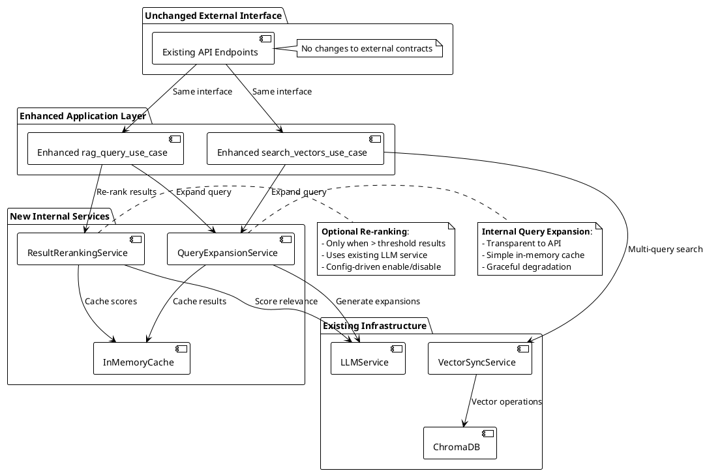

# Backend Feature Plan: RAG/Vector Search Query Intelligence Enhancement

## Planning Overview
- **Input**: `.planning/initial_query_verbesserung.md`
- **Branch**: `feature/query_verbesserung`
- **Complexity Score**: 6/15 (Moderate)
- **Test Strategy**: Focused Backend Testing
- **Approach**: Zero API/Frontend Changes - Invisible Performance Boost
- **Generated**: 2025-01-26

## Phase 1: Deep Exploration Results

### HYPERTHINK Analysis Summary

The RAG/Vector Search improvement feature represents a sophisticated enhancement requiring careful integration of multiple advanced techniques:

**Core Challenge**: Current single-shot vector search (User Query → Embedding → ChromaDB → Top-K) suffers from terminology gaps, lacks query refinement, and produces suboptimal RAG answers.

**Key Architectural Insights**:
- **Query Intelligence Pipeline**: Multi-stage process involving expansion, multi-query search, and re-ranking
- **Protocol-Agnostic Design**: Must work seamlessly across both MCP and HTTP endpoints
- **Graceful Degradation**: LLM-dependent features must degrade gracefully when LLM services unavailable
- **Performance vs. Quality Trade-offs**: Balancing enhanced search quality against increased latency and token usage

### Context Research Findings

#### Advanced RAG Techniques (nirdiamant/rag_techniques)
**Multi-Query and Query Transformation Patterns**:
- **Query Rewriting**: LLM-based reformulation for better specificity
- **Step-back Prompting**: Generate broader queries for background context
- **Sub-query Decomposition**: Break complex queries into simpler components
- **Multi-Query Retrieval**: Execute multiple query variants and deduplicate results

**Re-ranking Strategies**:
- **LLM-based Re-ranking**: Use LLM to score chunk relevance with structured prompts
- **Cross-Encoder Models**: Transformer models specifically trained for relevance scoring
- **Contextual Compression**: Extract key information before final ranking

**Implementation Patterns**:
```python
# Query Expansion with LLM (Core Implementation)
def expand_query_intelligently(query: str) -> List[str]:
    expansion_prompt = f"""
    Original query: "{query}"
    Generate 2-3 alternative search queries using different terminology:
    - Synonyms and related terms
    - Technical vs. colloquial language
    - Abbreviations and full forms
    """
    # LLM call returns alternative queries
    return [query] + alternative_queries

# Multi-Query Vector Search with Deduplication
def enhanced_vector_search(query: str, collection: str, limit: int):
    expanded_queries = expand_query_intelligently(query)
    all_results = []
    
    for variant_query in expanded_queries:
        results = vector_service.search(variant_query, collection, limit)
        all_results.extend(results)
    
    # Deduplicate and rank by composite score
    return deduplicate_and_rank(all_results, query, limit)
```

#### Production RAG Architecture (sciphi-ai/r2r)
**Enterprise-Grade Patterns**:
- **Multi-Query Expansion**: Generate alternative search terms for better coverage
- **LLM-based Re-ranking**: Score chunk relevance after initial retrieval
- **Streaming Response Architecture**: Real-time response delivery with `ReadableStream`
- **Agent-based RAG**: LLM decides retrieval strategy dynamically

**Production Considerations**:
- **Authentication & User Scoping**: Restrict search to user's accessible documents
- **Configuration-Driven**: Extensive parameterization for different use cases
- **Error Handling**: Comprehensive error boundaries with graceful degradation

#### Optimization Patterns (superlinear-ai/raglite)
**Advanced Query Processing**:
- **Adaptive Retrieval**: LLM decides whether and what to retrieve per query
- **Multi-Query Generation**: Create semantic variations of search terms
- **Result Deduplication**: Smart merging of results from multiple query variants
- **Late Chunking**: Contextual chunk headings improve semantic understanding

**Performance Optimization**:
- **Prompt Caching**: Reduce costs through caching-aware message structures
- **In-Memory Result Caching**: Cache expanded queries and re-ranking results
- **Batch Processing**: Process multiple query variants efficiently

### Backend-Only Feature Technical Analysis

#### Core Principle: Zero API/Frontend Changes

**Approach**: Enhance existing `search_vectors_use_case` and `rag_query_use_case` internally without changing external interfaces.

#### Backend Services Needed

1. **QueryExpansionService**
   - **Purpose**: Generate alternative query variants via existing LLM service
   - **Interface**: `expand_query_intelligently(query: str) -> List[str]`
   - **Caching**: Simple in-memory cache with TTL

2. **Enhanced Vector Search Logic**
   - **Purpose**: Multi-query search with result deduplication
   - **Integration**: Direct enhancement of `application_layer/vector_search.py`
   - **Fallback**: Graceful degradation to original query on expansion failure

3. **Result Re-ranking Logic**
   - **Purpose**: LLM-based relevance scoring (optional Phase 2)
   - **Integration**: Enhanced RAG pipeline in `application_layer/rag_query.py`
   - **Trigger**: Only when results > threshold (e.g., > 8 chunks found)

#### Configuration-Driven Features

```env
# Feature flags for gradual rollout
RAG_QUERY_EXPANSION_ENABLED=true
RAG_AUTO_RERANKING_ENABLED=true
RAG_MAX_QUERY_VARIANTS=3
RAG_RERANKING_THRESHOLD=8
```

#### Unchanged External Interfaces

**Existing API Endpoints** (no changes):
- `POST /api/vector-sync/search` - Enhanced internally
- `POST /api/query` - Enhanced RAG pipeline internally

**Existing Response Format** (no changes):
- Same response structure for backward compatibility
- Internal improvements invisible to clients

### Backend-Only Architecture Plan



### Quality Requirements

**Performance Benchmarks**:
- **Enhanced Search Latency**: < 10 seconds for multi-query with re-ranking (realistic for LLM calls)
- **Token Usage Impact**: < 2x increase in LLM token consumption
- **Caching Hit Rate**: > 50% for query expansions after initial usage

**Accuracy Improvements**:
- **Subjective Quality**: 20-30% improvement in RAG answer relevance
- **Retrieval Coverage**: Higher diversity of relevant documents found
- **Edge Case Handling**: Better performance on abbreviations, synonyms, domain terms

**Reliability Standards**:
- **Graceful Degradation**: Fallback to original query when LLM expansion fails
- **Error Recovery**: Automatic fallback to vector-similarity ranking when re-ranking fails
- **Backward Compatibility**: Zero breaking changes to existing APIs

## Phase 2: Intelligent Planning Results

### Complexity Assessment Breakdown
- **Backend Complexity**: 3/5 - LLM service integration, result deduplication, simple caching
- **Frontend Complexity**: 0/5 - No frontend changes required
- **Integration Complexity**: 3/5 - Internal service integration only, no API changes
- **Total Score**: 6/15 - **Moderate**

### Selected Test Strategy: Focused Backend Testing

**Why This Strategy**: The 6/15 complexity score indicates moderate backend changes with zero frontend/API integration complexity. Focus on backend service testing and integration.

**Testing Approach**:
- **Backend Testing**: Unit tests for QueryExpansionService + Integration tests with LLMService + Result deduplication logic tests
- **Service Integration Testing**: Enhanced use-case testing + LLM service mocking for consistent tests + Configuration-driven feature testing
- **Fallback Testing**: Error scenario testing (LLM expansion fails, re-ranking fails)
- **Coverage Target**: 75%

### Simplified Task Breakdown

#### Phase 1: Query Expansion (Week 1)
**Test-First Implementation Sequence**:

1. **TEST-FIRST: Query Expansion Service**
   - Write tests for `QueryExpansionService` class structure
   - Write tests for LLM prompt generation and response parsing
   - Write tests for simple in-memory caching behavior
   - Write tests for graceful fallback when LLM fails
   - **IMPLEMENT**: QueryExpansionService with LLM integration
   - **VERIFY**: All expansion tests pass

2. **TEST-FIRST: Enhanced Vector Search Use Case**
   - Write tests for multi-query orchestration logic
   - Write tests for result deduplication algorithms
   - Write tests for configuration-driven feature toggling
   - **IMPLEMENT**: Enhanced `search_vectors_use_case`
   - **VERIFY**: All vector search enhancement tests pass

#### Phase 2: Result Re-ranking (Week 2)
**Test-First Implementation Sequence**:

3. **TEST-FIRST: Result Re-ranking Logic**
   - Write tests for LLM-based chunk relevance scoring
   - Write tests for threshold-based re-ranking trigger
   - Write tests for fallback to similarity-based ranking
   - **IMPLEMENT**: Re-ranking logic in `rag_query_use_case`
   - **VERIFY**: All re-ranking tests pass

4. **TEST-FIRST: Complete Integration Testing**
   - Write end-to-end tests for enhanced search pipeline
   - Write configuration tests for feature flags
   - Write performance tests to ensure acceptable latency
   - **VERIFY**: System-wide integration tests pass

### Backend Quality Gates

**Required validations before each commit**:
- **Backend**: Test suite passing, type checking, configuration validation
- **Integration**: Enhanced use-case tests passing, LLM service mocking working
- **Performance**: Response time < 10s, token usage < 2x baseline
- **Error Handling**: Graceful fallback tests passing

### Success Criteria

**Feature completion requirements**:
- **Multi-Query Search**: Query expansion working with configuration flags
- **LLM Re-ranking**: Optional result scoring improving answer quality
- **Performance**: Enhanced search completes within acceptable latency bounds
- **Backward Compatibility**: Zero API/Frontend changes, existing behavior unchanged
- **Error Handling**: Graceful degradation when LLM expansion/re-ranking fails
- **Test Coverage**: 75% coverage across all new backend components
- **Configuration**: Feature flags allow granular control and rollback

## Implementation Roadmap

### Simplified Development Sequence (Test-First Mandatory)

1. **Backend Test Infrastructure**: Setup LLM service mocking for consistent testing
2. **Test-Driven Query Expansion**: Write expansion tests → implement service → verify
3. **Test-Driven Enhanced Vector Search**: Write multi-query tests → implement logic → verify
4. **Test-Driven Re-ranking Integration**: Write re-ranking tests → implement logic → verify
5. **Configuration & Feature Flags**: Environment-based feature control setup
6. **Integration & Performance Validation**: End-to-end testing of enhanced pipeline

**KEY PRINCIPLE**: Each item includes immediate testing - never move to next item until current item is fully tested and working.

### Risk Mitigation

**Technical Risks**:
- **LLM Service Latency**: Realistic timeout handling and graceful fallback to original query
- **Token Cost Escalation**: Simple in-memory caching and usage monitoring
- **Result Quality Regression**: Configuration flags enable immediate rollback
- **Performance Degradation**: Benchmark testing and realistic performance targets

**Operational Risks**:
- **Zero User Disruption**: No API/Frontend changes eliminate user confusion risk
- **Backward Compatibility**: Zero changes to external interfaces guarantee compatibility
- **Service Dependencies**: Graceful fallback patterns for LLM service failures

### Dependencies & Prerequisites

**External Dependencies**:
- **Existing LLM Service**: Uses already configured OpenAI/Ollama services
- **Sufficient Memory**: Simple in-memory caching requires minimal additional memory

**Development Environment**:
- **LLM Service Mocks**: Deterministic responses for consistent testing
- **Configuration Management**: Environment variables for feature flags

## Architecture Decisions

### ADR-001: LLM-Based Query Expansion Over Static Glossary

**Status**: Proposed

**Context**: Original proposal included static glossary for query expansion (synonyms, abbreviations). Research revealed modern LLM-based expansion offers superior flexibility and context awareness.

**Decision**: Implement LLM-based dynamic query expansion with optional minimal static glossary for critical domain terms.

**Alternatives**:
1. **Pure Static Glossary**: High maintenance, context-insensitive
2. **Hybrid Approach**: Combine LLM + static mappings
3. **Rule-Based Expansion**: Pattern matching for abbreviations

**Consequences**:
- **Positive**: Context-aware expansions, zero maintenance, scales across domains
- **Negative**: LLM dependency, token costs, potential latency
- **Mitigation**: Aggressive caching, fallback to original query on LLM failure

### ADR-002: Comprehensive Re-ranking Over Simple Score Boosting

**Status**: Proposed  

**Context**: Multiple approaches available for improving retrieval relevance: simple score adjustments, cross-encoder models, or LLM-based re-ranking.

**Decision**: Implement LLM-based re-ranking with batch processing optimization.

**Alternatives**:
1. **Cross-Encoder Models**: Faster but requires model deployment
2. **Score Boosting**: Simple but limited effectiveness
3. **Multiple Re-rankers**: Complex configuration

**Consequences**:
- **Positive**: Highest quality results, leverages existing LLM infrastructure
- **Negative**: Higher token costs, latency impact
- **Mitigation**: Batch processing, selective re-ranking, result caching

### ADR-003: Zero API/Frontend Changes Over Feature-Rich UI

**Status**: Proposed

**Context**: Original plan included enhanced search controls, analytics displays, and new API endpoints. Alternative approach is invisible backend enhancement.

**Decision**: Implement zero API/Frontend changes with automatic enhancement.

**Alternatives**:
1. **Full UI Enhancement**: Rich controls and analytics
2. **Minimal UI Toggle**: Simple on/off switch
3. **Configuration-Driven**: Admin-only feature control

**Consequences**:
- **Positive**: Zero breaking changes, dramatically reduced complexity, invisible user improvement
- **Negative**: No user control over enhancement features
- **Mitigation**: Configuration flags allow admin control and rollback capability

## Execution Instructions

**To execute this plan:**
```bash
/execute .planning/PLAN_query_verbesserung.md
```

**The execution will:**
- Implement focused test-first development with 75% coverage
- Build multi-query search with LLM expansion capabilities  
- Add optional intelligent LLM-based result re-ranking
- Maintain zero API/Frontend changes for invisible enhancement
- Ensure complete backward compatibility and graceful degradation
- Implement configuration-driven feature control and rollback
- Validate realistic performance benchmarks and quality improvements

**CRITICAL EXECUTION RULE: Every implementation step must be preceded by tests. No code without tests.**

## Quality Validation

### Plan Quality Assessment
- [x] Simplified backend-only architecture with zero API/Frontend changes
- [x] LLM integration strategies using existing service infrastructure
- [x] Realistic performance targets and caching strategies defined
- [x] Test-first development approach with appropriate 75% coverage target
- [x] Architecture decisions favor simplicity and backward compatibility
- [x] Risk mitigation strategies emphasize graceful fallback and configuration control
- [x] Success criteria focused on invisible user improvement
- [x] Context research provided actionable implementation guidance

**Plan Confidence Score**: 9/10 for supporting successful backend enhancement implementation

**This streamlined plan focuses on delivering maximum user value through invisible backend improvements while minimizing implementation complexity and risk.**