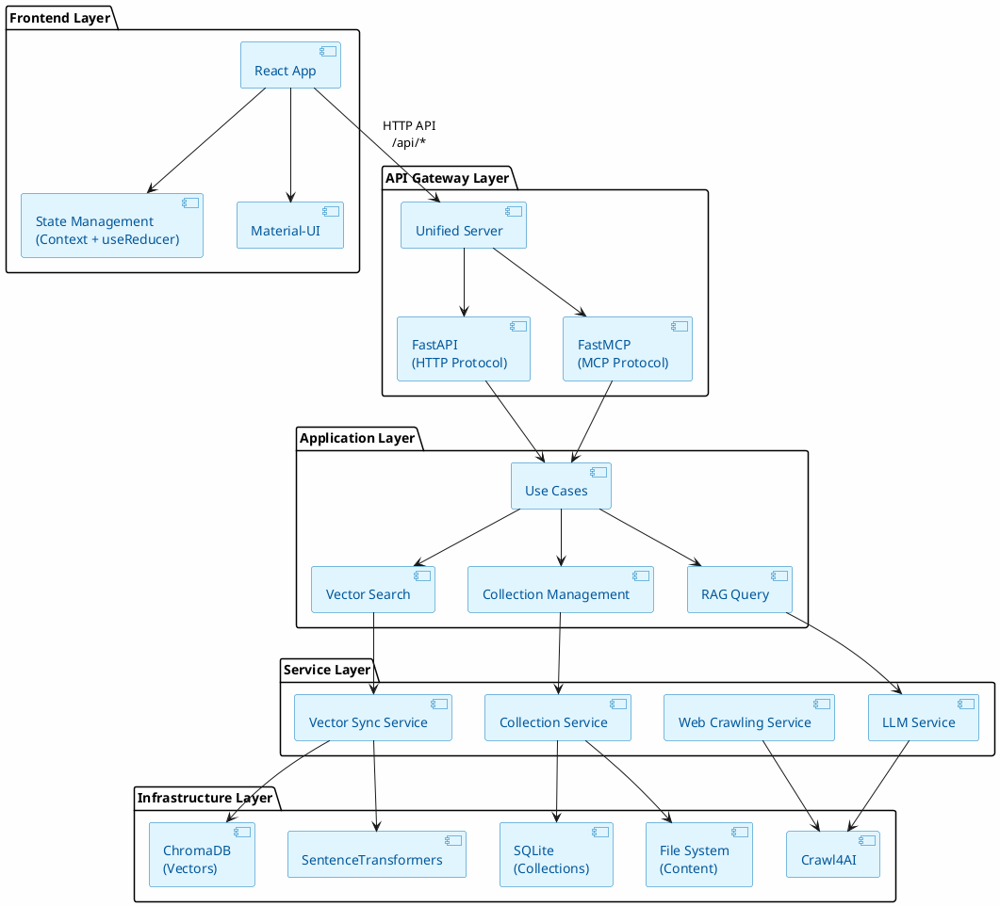
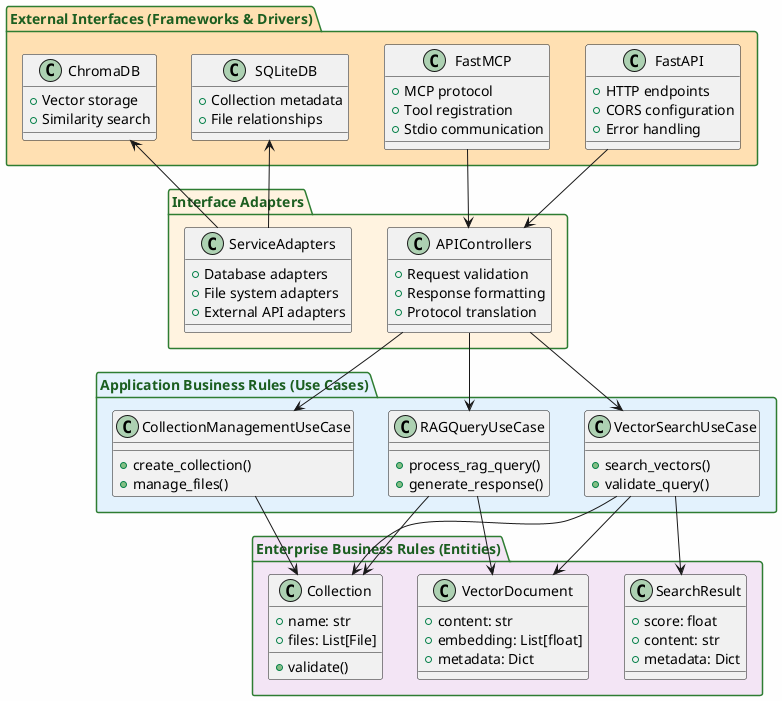
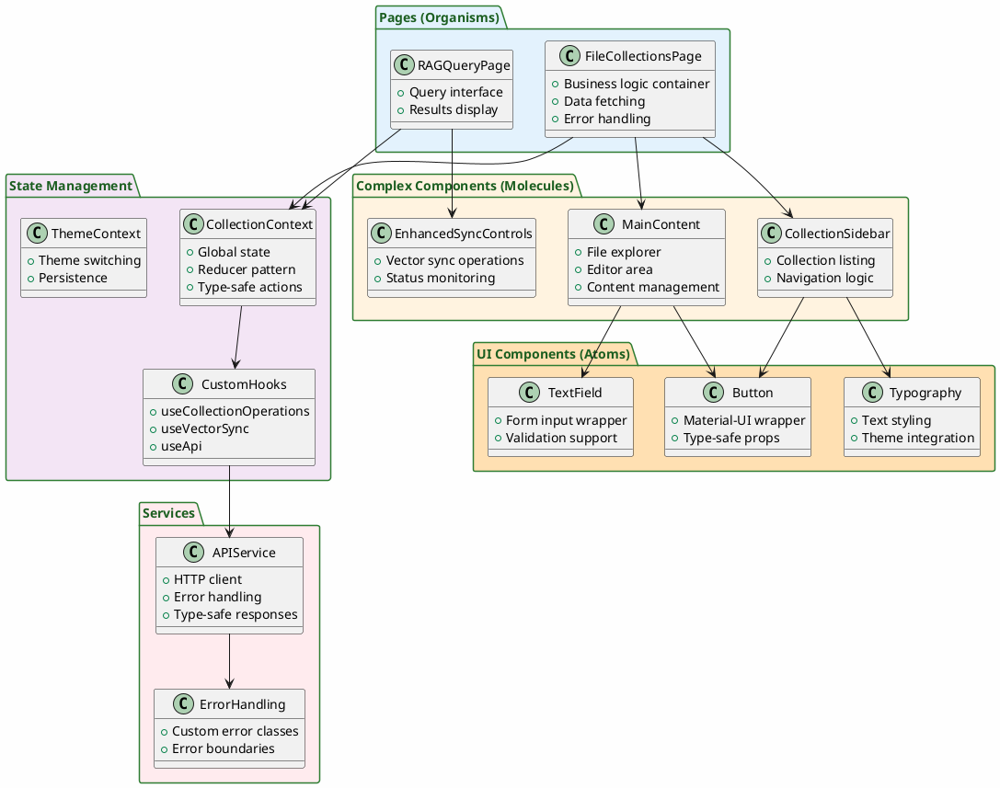
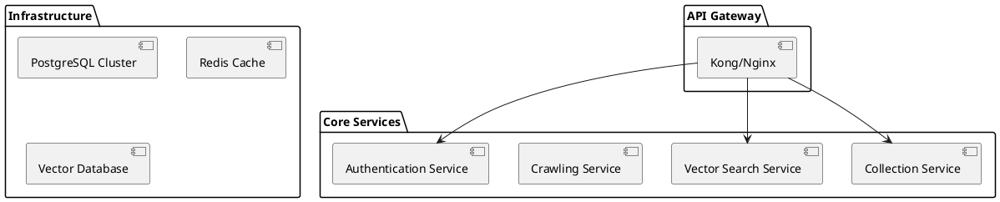

# Crawl4AI MCP Server - Comprehensive Architecture Audit 2024

> **Executive Summary**: This audit examines the Crawl4AI MCP Server architecture, identifying strengths in clean architecture implementation and unified protocol handling, while highlighting critical areas for improvement in security, performance, and maintainability.

---

## Table of Contents

- [System Overview](#system-overview)
- [Architecture Diagrams](#architecture-diagrams)
- [Backend Architecture Analysis](#backend-architecture-analysis)
- [Frontend Architecture Analysis](#frontend-architecture-analysis)
- [Critical Issues & Technical Debt](#critical-issues--technical-debt)
- [Architecture Best Practices Comparison](#architecture-best-practices-comparison)
- [Recommendations](#recommendations)
- [Implementation Roadmap](#implementation-roadmap)

---

## System Overview

The Crawl4AI MCP Server represents a sophisticated **unified server architecture** that successfully bridges multiple protocols (MCP and REST) while maintaining clean separation of concerns. The system demonstrates advanced patterns including **Clean Architecture**, **Dependency Injection**, **Hexagonal Architecture**, and **Protocol-Agnostic Business Logic**.

### Key Components
- **Backend**: Python-based unified server with MCP and HTTP protocol support
- **Frontend**: React/TypeScript SPA with Material-UI and sophisticated state management  
- **Storage**: Polyglot persistence (SQLite, ChromaDB, File System)
- **Protocols**: Model Context Protocol (MCP) + RESTful HTTP API

---

## Architecture Diagrams

### High-Level System Architecture



### Backend Clean Architecture Layers



### Frontend Component Architecture



---

## Backend Architecture Analysis

### ✅ Architectural Strengths

#### 1. **Unified Server Pattern Excellence**
**Location**: `unified_server.py:58-86`

The system successfully implements a sophisticated **dual-protocol unified server**:

```python
class UnifiedServer:
    """
    Unified server that handles both MCP and HTTP protocols.
    
    Uses dependency injection container to provide shared services
    to both protocol handlers, ensuring consistent behavior and
    shared state management.
    """
```

**Benefits**:
- Eliminates code duplication between protocols
- Ensures behavioral consistency across MCP and HTTP
- Simplifies deployment and maintenance
- Shared state management reduces complexity

#### 2. **Clean Architecture Implementation**
The codebase demonstrates excellent **Clean Architecture** principles:

```
Protocol Layer → Application Layer → Service Layer → Infrastructure Layer
```

**Evidence**:
- **Application Layer**: `application_layer/` contains protocol-agnostic use cases
- **Service Layer**: `services/interfaces.py` defines abstract contracts
- **Infrastructure**: Concrete implementations properly separated

#### 3. **Professional Configuration Management**
**Location**: `config/paths.py:17-92`

**Pattern**: **Configuration Hierarchy** with professional directory structure:

```python
class Context42Config:
    """
    Centralized configuration manager for ~/.context42/ user directory.
    
    Features:
    - Professional user directory organization (~/.context42/)
    - Environment variable override support  
    - Automatic directory structure creation
    - Data migration from legacy locations
    """
```

#### 4. **Sophisticated Dependency Injection**
**Location**: `services/containers.py:30-131`

**Pattern**: **Declarative Container** using `dependency-injector`:

```python
# Shared singletons for state consistency
collection_service = providers.Singleton(CollectionService)

# Vector sync service (optional, graceful degradation)
vector_sync_service = providers.Singleton(
    VectorSyncService,
    vector_store=None,  # Will be initialized by the service if available
    collection_service=collection_service
)
```

### ⚠️ Critical Backend Issues

#### 1. **Protocol Consistency Problems**
**Impact**: High | **Priority**: Critical

**Issue**: Error response formats differ significantly between protocols:

```python
# MCP Format
{"success": false, "error": "message"}

# HTTP Format  
{"detail": {"error": {"code": "COLLECTION_NOT_FOUND", "message": "...", "details": {...}}}}
```

**Location**: `unified_server.py:542-1324`

#### 2. **Data Access Anti-Patterns**
**Impact**: High | **Priority**: Critical

**Location**: `tools/collection_manager.py:49-449`

**Issues**:
- Mixed file system and database operations without transactions
- No ACID transaction support for complex operations
- Potential race conditions in concurrent access
- Security validation scattered across methods

```python
def _validate_path_security(self, collection_name: str, filename: str = None, folder: str = None) -> Path:
    """Validate and sanitize paths to prevent traversal attacks."""
    # Sanitize collection name
    safe_collection = collection_name.replace('..', '').replace('/', '_').replace('\\', '_')
```

#### 3. **Performance Bottlenecks**
**Impact**: Medium | **Priority**: High

**Issues Identified**:
- No database connection pooling for SQLite
- Synchronous file operations in async context
- No caching strategies for frequently accessed data
- Missing batch processing for large collections

#### 4. **Security Vulnerabilities**
**Impact**: High | **Priority**: Critical

**Critical Security Issues**:
- No authentication mechanism implemented
- Insufficient input validation for URL inputs
- No content sanitization for crawled content
- Missing rate limiting for external requests
- Overly permissive CORS settings

---

## Frontend Architecture Analysis

### ✅ Frontend Strengths

#### 1. **Enterprise-Grade Component Architecture**
The application excellently implements **Atomic Design** principles:

- **Atoms**: `src/components/ui/` - Material-UI wrappers with TypeScript
- **Molecules**: Form components, modals, navigation
- **Organisms**: `CollectionSidebar`, `MainContent` - complex business logic

#### 2. **Sophisticated State Management**
**Location**: `src/contexts/CollectionContext.tsx`

**Pattern**: **Context API + useReducer** with TypeScript safety:

```typescript
interface CollectionState {
  collections: FileCollection[];
  selectedCollection: string | null;
  files: FileNode[];
  folders: FolderNode[];
  editor: EditorState;
  vectorSync: { statuses: Record<string, VectorSyncStatus> };
  ui: { loading: {...}, modals: {...}, error: string | null };
}
```

**Benefits**:
- Predictable state updates through reducer pattern
- Type-safe actions with discriminated unions
- Granular loading states for different operations
- Centralized modal state management

#### 3. **Advanced Custom Hooks Strategy**
**Location**: `src/hooks/`

Complex business logic properly encapsulated:

- **`useCollectionOperations`**: CRUD operations with error handling
- **`useVectorSync`**: Vector synchronization state management
- **`useApi`**: API integration with caching strategies

#### 4. **Comprehensive Testing Architecture**

**Multi-layered Testing Strategy**:
- **Unit Tests**: Vitest + React Testing Library
- **E2E Tests**: Playwright with retry strategies
- **Quality Pipeline**: `npm run quality:check`

#### 5. **Modern Build & TypeScript Integration**
**Configuration**: `vite.config.ts` + strict TypeScript setup

**Features**:
- Modern build with Vite
- Strict TypeScript configuration
- Source maps for debugging
- ESLint with React Hooks rules

### ⚠️ Frontend Issues

#### 1. **Missing Traditional Caching**
**Impact**: Medium | **Priority**: Medium

The application lacks modern caching strategies:
- No React Query or SWR implementation
- Manual state management increases complexity
- Potential over-fetching of data
- Missing background refresh patterns

#### 2. **Performance Optimization Gaps**
**Impact**: Medium | **Priority**: Medium

**Issues**:
- Limited code splitting implementation
- No lazy loading for heavy components
- Missing virtualization for large lists
- Potential memory leaks in event listeners

#### 3. **Error Handling Inconsistencies**
**Impact**: Low | **Priority**: Medium

**Issues**:
- Different error handling patterns across components
- Missing error recovery strategies
- Inconsistent user error messaging
- No comprehensive error reporting

---

## Critical Issues & Technical Debt

### 🔥 **Critical Security Issues**

| Issue | Impact | Location | Priority |
|-------|--------|----------|----------|
| No Authentication | **Critical** | Entire API surface | **Immediate** |
| Path Traversal Vulnerabilities | **High** | `collection_manager.py:79-106` | **Immediate** |
| Insufficient Input Validation | **High** | All HTTP endpoints | **High** |
| Missing Rate Limiting | **Medium** | API endpoints | **High** |
| Overly Permissive CORS | **Medium** | `unified_server.py` | **Medium** |

### ⚡ **Performance Issues**

| Issue | Impact | Location | Priority |
|-------|--------|----------|----------|
| No Connection Pooling | **High** | SQLite operations | **High** |
| Synchronous File I/O | **Medium** | `collection_manager.py` | **Medium** |
| Missing Caching Layer | **Medium** | API responses | **Medium** |
| No Batch Processing | **Low** | Vector operations | **Low** |

### 🏗️ **Architecture Technical Debt**

| Issue | Impact | Location | Priority |
|-------|--------|----------|----------|
| Protocol Response Inconsistency | **High** | `unified_server.py` | **High** |
| Mixed Data Access Patterns | **High** | `collection_manager.py` | **High** |
| Global Container Dependencies | **Medium** | `services/containers.py` | **Medium** |
| Legacy File Manager | **Medium** | File-based collections | **Low** |

### 🧪 **Testing & Quality Issues**

| Issue | Impact | Location | Priority |
|-------|--------|----------|----------|
| SQLite Connection Leaks in Tests | **High** | `tests/conftest.py` | **High** |
| Incomplete Test Isolation | **Medium** | Global container usage | **Medium** |
| Missing API Documentation | **Medium** | All endpoints | **Medium** |
| Code Duplication | **Low** | Error handling across protocols | **Low** |

---

## Architecture Best Practices Comparison

### Backend: Clean Architecture Implementation

#### ✅ **Following Best Practices (2024 Standards)**

| Practice | Implementation | Grade |
|----------|----------------|-------|
| **Hexagonal Architecture** | ✅ Ports & Adapters pattern in `services/interfaces.py` | **A** |
| **Clean Architecture** | ✅ Clear layer separation | **A** |
| **Dependency Injection** | ✅ Professional DI container | **A** |
| **Protocol Agnostic Logic** | ✅ Shared use cases | **A** |
| **Professional Configuration** | ✅ `~/.context42/` pattern | **A** |

#### ⚠️ **Missing Best Practices**

| Practice | Status | Impact |
|----------|--------|--------|
| **Security-First Design** | ❌ No authentication/authorization | **Critical** |
| **Circuit Breaker Pattern** | ❌ No resilience for external services | **High** |
| **Event-Driven Architecture** | ❌ No async event processing | **Medium** |
| **Observability** | ❌ Limited monitoring/metrics | **Medium** |

### Frontend: React Modern Patterns

#### ✅ **Following 2024 Best Practices**

| Practice | Implementation | Grade |
|----------|----------------|-------|
| **Function Components + Hooks** | ✅ Consistent throughout | **A** |
| **Compound Components** | ✅ Collection management UI | **A** |
| **Custom Hooks Pattern** | ✅ Advanced business logic hooks | **A** |
| **TypeScript Integration** | ✅ Strict typing throughout | **A** |
| **Atomic Design** | ✅ Clear component hierarchy | **A** |

#### ⚠️ **Missing Modern Patterns**

| Practice | Status | Impact |
|----------|--------|--------|
| **Server State Management** | ❌ No React Query/SWR | **Medium** |
| **Code Splitting** | ⚠️ Limited implementation | **Medium** |
| **Error Boundaries** | ⚠️ Basic implementation | **Low** |
| **Performance Optimization** | ⚠️ Limited memo/callback usage | **Low** |

---

## Recommendations

### 🚀 **Immediate Actions (Next Sprint)**

#### 1. **Implement Authentication & Authorization**
```python
# Add to unified_server.py
from fastapi.security import HTTPBearer, HTTPAuthorizationCredentials

security = HTTPBearer()

@app.middleware("http")
async def auth_middleware(request: Request, call_next):
    # Implement JWT validation
    pass
```

#### 2. **Standardize Error Response Format**
```python
# Create unified error handler
class UnifiedErrorHandler:
    @staticmethod
    def format_error(error_code: str, message: str, details: dict = None) -> dict:
        return {
            "success": False,
            "error": {
                "code": error_code,
                "message": message,
                "details": details or {}
            }
        }
```

#### 3. **Implement Connection Pooling**
```python
# Add to services/database.py  
from sqlalchemy.pool import StaticPool

engine = create_engine(
    "sqlite:///path/to/db",
    poolclass=StaticPool,
    pool_size=10,
    max_overflow=20
)
```

### 📈 **Medium-Term Improvements (Next Quarter)**

#### 1. **Add Server State Management to Frontend**
```typescript
// Install and configure React Query
npm install @tanstack/react-query

// Add to App.tsx
import { QueryClient, QueryClientProvider } from '@tanstack/react-query';

const queryClient = new QueryClient();
```

#### 2. **Implement Circuit Breaker Pattern**
```python
# Add resilience for external services
from circuit_breaker import CircuitBreaker

@CircuitBreaker(failure_threshold=5, recovery_timeout=30)
async def crawl_url(url: str):
    # External crawling logic
    pass
```

#### 3. **Add Comprehensive Security Layer**
```python
# Implement security middleware
class SecurityMiddleware:
    def __init__(self):
        self.rate_limiter = RateLimiter()
        self.validator = InputValidator()
        self.sanitizer = ContentSanitizer()
```

### 🏗️ **Long-Term Strategic Changes (Next Year)**

#### 1. **Microservices Migration**


#### 2. **Event-Driven Architecture**
```python
# Implement async event processing
class EventBus:
    async def publish(self, event: Event):
        # Async event publishing
        pass
    
    async def subscribe(self, event_type: str, handler: Callable):
        # Event subscription
        pass
```

#### 3. **Observability & Monitoring**
```python
# Add OpenTelemetry integration
from opentelemetry import trace
from opentelemetry.exporter.jaeger import JaegerExporter

tracer = trace.get_tracer(__name__)

@tracer.start_as_current_span("vector_search")
async def search_vectors(query: str):
    # Traced operation
    pass
```

---

## Implementation Roadmap

### Phase 1: Security & Stability (Weeks 1-4)
- [ ] Implement authentication system
- [ ] Add input validation framework  
- [ ] Standardize error handling across protocols
- [ ] Fix database connection management
- [ ] Add comprehensive security testing

### Phase 2: Performance & Quality (Weeks 5-8)
- [ ] Implement connection pooling
- [ ] Add caching layer for API responses
- [ ] Optimize database queries
- [ ] Add performance monitoring
- [ ] Implement rate limiting

### Phase 3: Modern Patterns (Weeks 9-12)
- [ ] Add React Query for server state
- [ ] Implement code splitting in frontend
- [ ] Add circuit breaker pattern
- [ ] Enhance error boundaries
- [ ] Add comprehensive API documentation

### Phase 4: Architecture Evolution (Months 4-6)
- [ ] Design microservices architecture
- [ ] Implement event-driven patterns
- [ ] Add container orchestration
- [ ] Implement observability stack
- [ ] Plan horizontal scaling strategy

---

## Conclusion

The Crawl4AI MCP Server demonstrates **sophisticated architectural understanding** with excellent implementation of modern patterns including **Clean Architecture**, **Hexagonal Architecture**, and **Unified Protocol Handling**. The React frontend showcases **enterprise-grade component architecture** with advanced state management patterns.

### Key Strengths:
- ✅ **Professional Architecture**: Clean Architecture and Hexagonal patterns properly implemented
- ✅ **Protocol Unification**: Successful bridging of MCP and HTTP protocols
- ✅ **Modern Frontend**: React with TypeScript, compound components, and sophisticated state management
- ✅ **Comprehensive Testing**: Multi-layered testing strategy

### Critical Improvements Needed:
- 🔥 **Security**: Authentication, input validation, and content sanitization
- ⚡ **Performance**: Connection pooling, caching, and async optimization
- 🏗️ **Consistency**: Unified error handling and API response formats
- 📊 **Observability**: Monitoring, logging, and performance metrics

The architecture provides a **solid foundation** for future expansion while maintaining flexibility for evolving requirements. Addressing the identified security vulnerabilities and performance bottlenecks will elevate this system to **production-ready status** suitable for enterprise deployment.

**Overall Architecture Grade: B+** 
*(Excellent patterns, critical security gaps)*