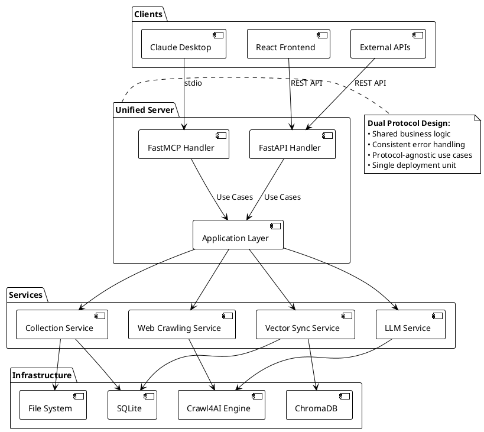
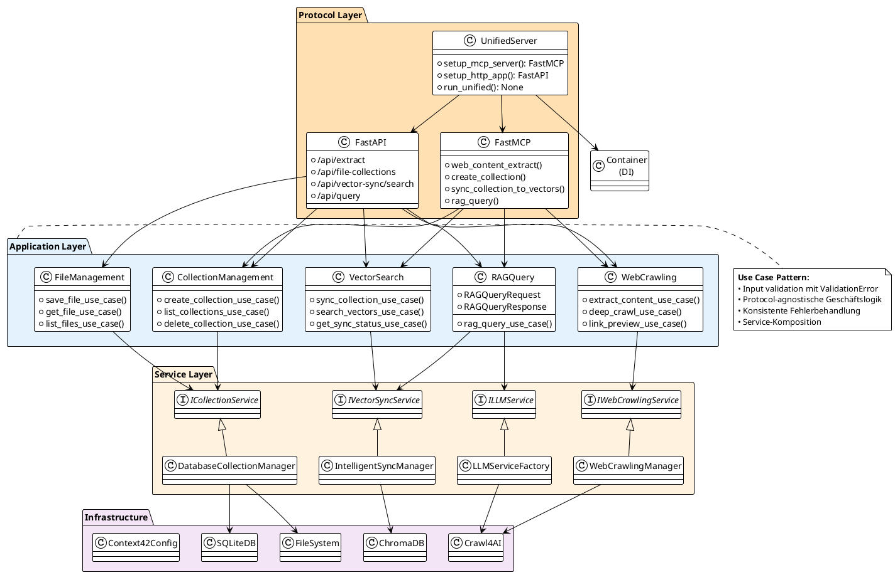
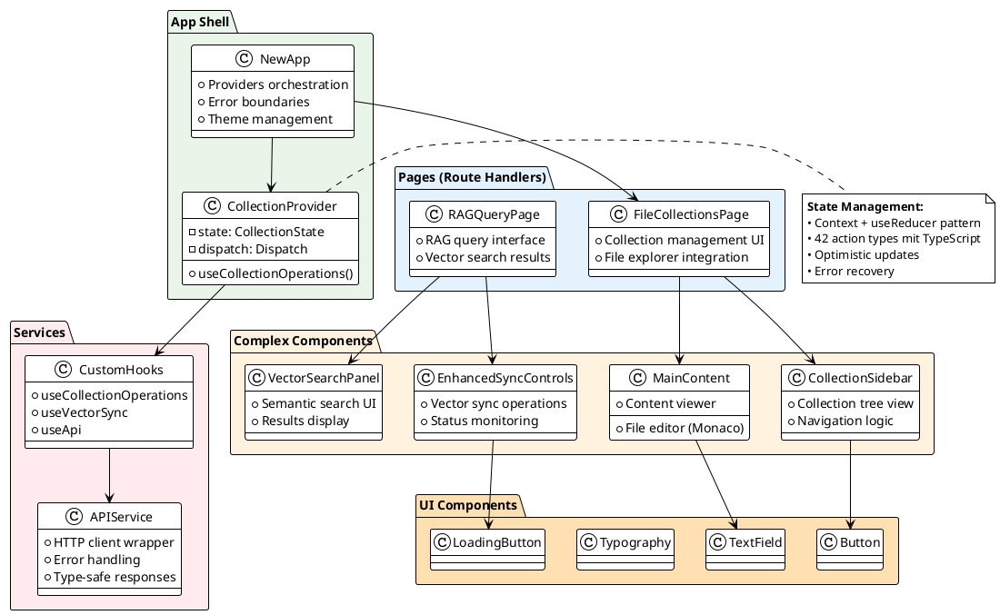
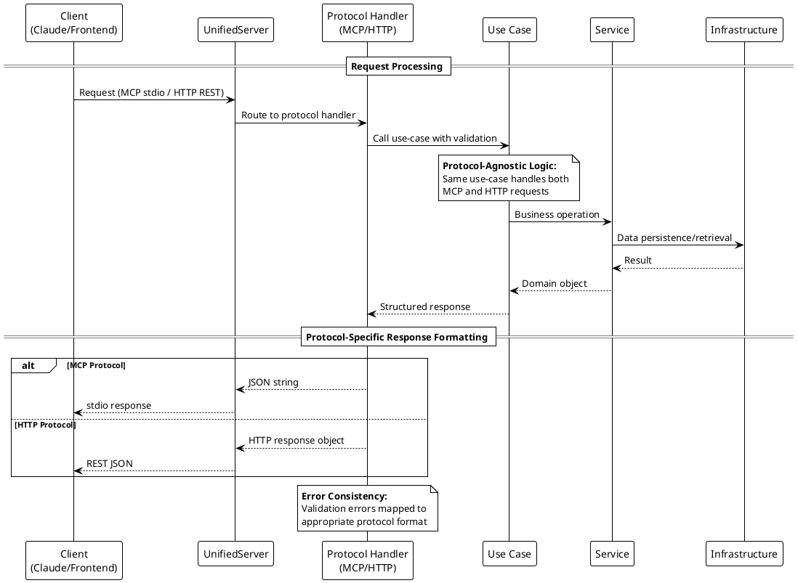
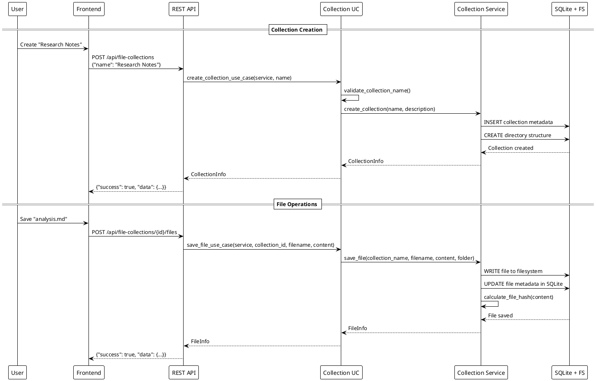
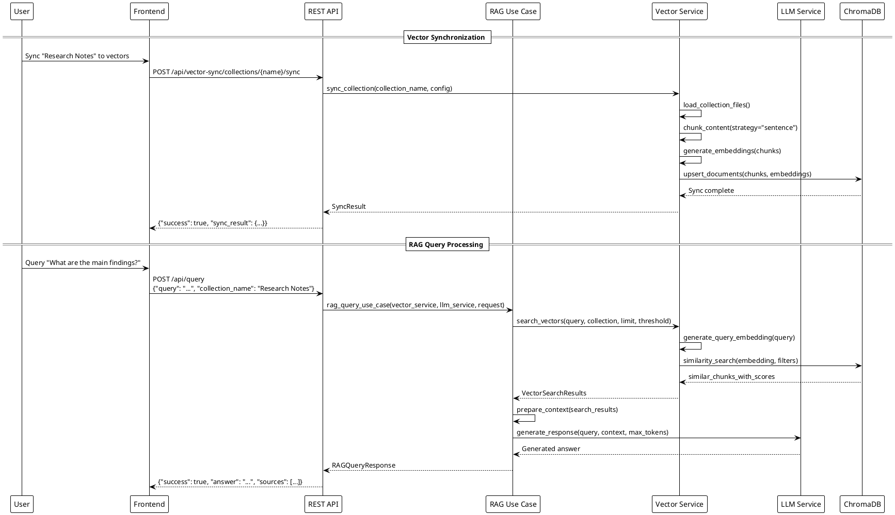
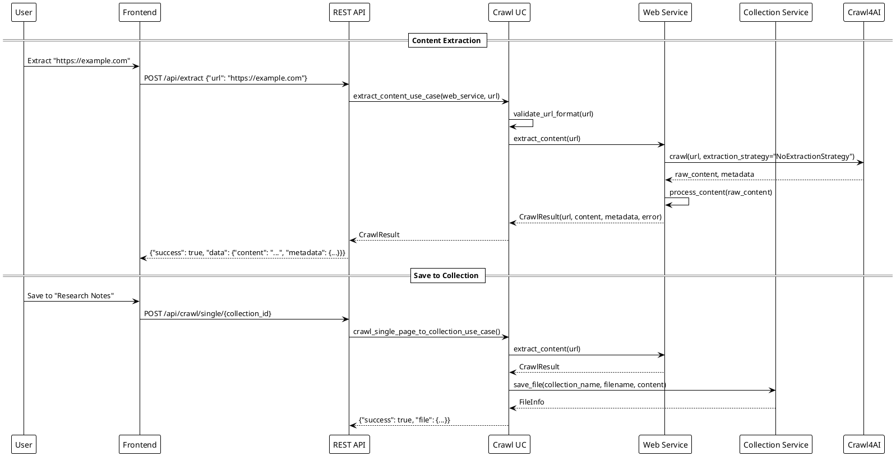
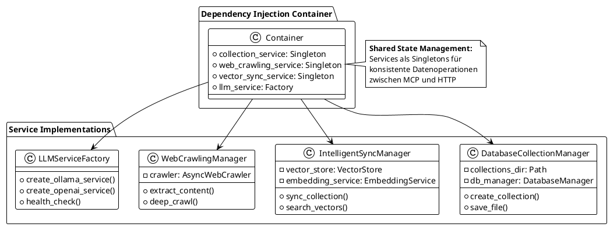
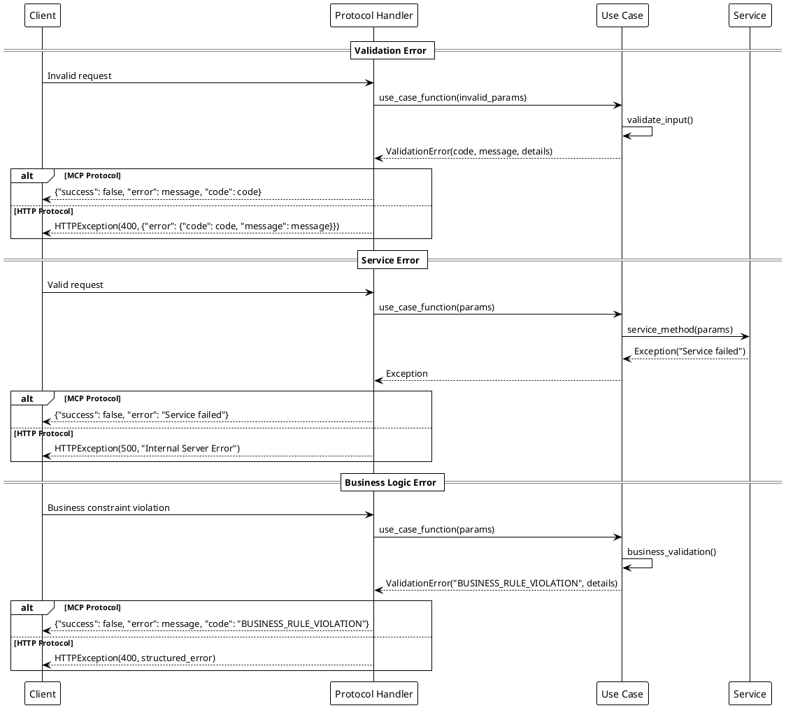
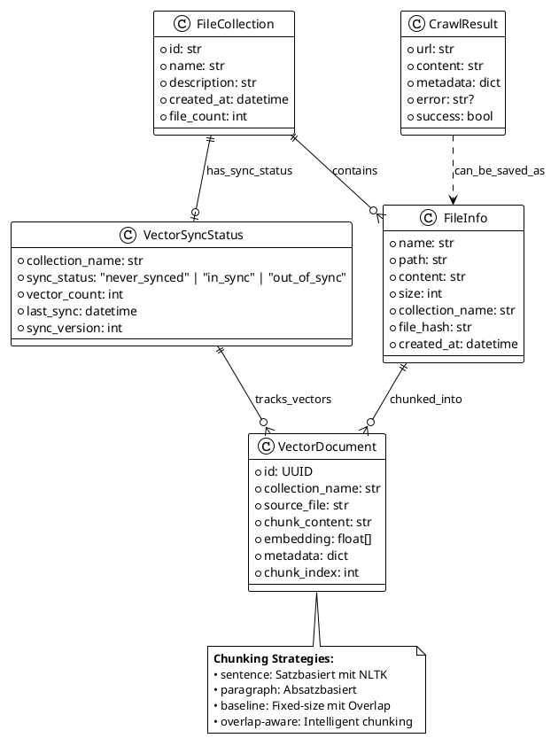

# Crawl4AI MCP Server - Architektur Dokumentation

> **System Überblick**: Unified Server Architektur mit dual-protocol Support (MCP + HTTP), Clean Architecture Patterns und umfassendem Vector-RAG-System für Web-Content-Management.

## Inhaltsverzeichnis
1. [System Überblick](#system-überblick)
2. [Statische Architektur](#statische-architektur)
3. [Dynamische Request-Flows](#dynamische-request-flows)
4. [Datenfluss und Integration](#datenfluss-und-integration)
5. [Persistierung](#persistierung)
6. [Deployment](#deployment)

---

## System Überblick

### Unified Server Pattern

Das System implementiert eine **einheitliche Server-Architektur** die MCP (Model Context Protocol) und HTTP REST parallel bedient:



### Kernprinzipien

- **Clean Architecture**: Schichtentrennung mit Dependency Inversion
- **Protocol-Agnostik**: Business Logic unabhängig vom Transport
- **Unified Deployment**: Ein Server-Prozess für beide Protokolle
- **Graceful Degradation**: Optional dependencies (RAG, LLM)
- **Professional Configuration**: `~/.context42/` Benutzerverzeichnis

---

## Statische Architektur

### Backend - Clean Architecture Layers



### Frontend - React Component Architektur



---

## Dynamische Request-Flows

### Unified Protocol Request Flow



### Collection Management Workflow



### Vector Search + RAG Integration



### Web Crawling Integration



---

## Datenfluss und Integration

### Service Layer Integration



### Error Handling Strategy



---

## Persistierung

### User Directory Structure

```text
~/.context42/
├── databases/
│   ├── vector_sync.db              # SQLite: Collections & Sync Status
│   └── chromadb/                   # ChromaDB: Vector Store
│       └── crawl4ai_documents/
├── config/
│   ├── default.env                 # Standard-Konfiguration
│   └── user.env                    # Benutzer-Overrides
├── logs/
│   └── crawl4ai-mcp.log           # Zentralisiertes Logging
└── cache/
    └── crawling/                   # Optional: Crawling Cache
```

### Data Model Relationships



### Storage Architecture

```puml
@startuml storage_architecture
!theme plain

package "Storage Layer" {
  database "SQLite\n(~/.context42/databases/)" as SQLite {
    table collections {
      id: TEXT PRIMARY KEY
      name: TEXT UNIQUE
      description: TEXT
      created_at: TEXT
      file_count: INTEGER
    }
    
    table collection_files {
      id: TEXT PRIMARY KEY
      collection_name: TEXT
      filename: TEXT
      folder: TEXT
      content: TEXT
      size: INTEGER
    }
    
    table vector_sync_status {
      collection_name: TEXT PRIMARY KEY
      sync_status: TEXT
      vector_count: INTEGER
      last_sync: TEXT
    }
  }
  
  database "ChromaDB\n(~/.context42/databases/chromadb/)" as ChromaDB {
    collection crawl4ai_documents {
      id: UUID
      embedding: VECTOR
      metadata: JSON
      document: TEXT
    }
  }
  
  package "File System" as FS {
    file "Collection Files\n(content storage)"
    file "Config Files\n(~/.context42/config/)"
    file "Logs\n(~/.context42/logs/)"
  }
}

package "Service Access" {
  class DatabaseCollectionManager {
    +SQLite operations
    +File system operations
  }
  
  class IntelligentSyncManager {
    +ChromaDB operations
    +Embedding operations
  }
  
  class Context42Config {
    +Configuration management
    +Directory setup
  }
}

DatabaseCollectionManager --> SQLite
DatabaseCollectionManager --> FS
IntelligentSyncManager --> ChromaDB
Context42Config --> FS

@enduml
```

---

## Deployment

### Development vs Production Setup

```puml
@startuml deployment
!theme plain

package "Development Environment" {
  node "Local Machine" {
    [React Dev Server\n:3000] as ReactDev
    [Unified Server\n:8000] as ServerDev
    [SQLite DB] as DBDev
    [ChromaDB] as VectorDev
  }
  
  [Claude Desktop] as ClaudeDev
  [Browser] as BrowserDev
}

package "Production Environment" {
  node "Server/Container" {
    [Built React App\n(static)] as ReactProd
    [Unified Server\n:8000] as ServerProd
    [SQLite DB] as DBProd
    [ChromaDB] as VectorProd
  }
  
  [MCP Clients] as MCPProd
  [Web Clients] as WebProd
}

== Development Mode ==
BrowserDev -> ReactDev : http://localhost:3000
ReactDev -> ServerDev : API calls to :8000
ClaudeDev -> ServerDev : MCP stdio protocol

ServerDev -> DBDev : SQLite operations
ServerDev -> VectorDev : Vector operations

== Production Mode ==
WebProd -> ReactProd : Static file serving
WebProd -> ServerProd : REST API
MCPProd -> ServerProd : MCP protocol

ServerProd -> DBProd : SQLite operations
ServerProd -> VectorProd : Vector operations

note right of ServerDev
  **Development Features:**
  • CORS enabled für Frontend
  • Debug logging
  • Hot reload mit Vite
  • Concurrent protocols
end note

note right of ServerProd
  **Production Features:**
  • Process management
  • Error tracking  
  • Performance monitoring
  • Security headers
end note

@enduml
```

### Configuration Management

```puml
@startuml configuration
!theme plain

class Context42Config {
  +CONTEXT42_HOME: Path
  +databases_dir: Path
  +config_dir: Path
  +logs_dir: Path
  
  +setup_directories()
  +migrate_legacy_data()
  +load_environment_config()
}

package "Configuration Hierarchy" {
  [Environment Variables] as ENV
  [~/.context42/config/user.env] as UserEnv
  [~/.context42/config/default.env] as DefaultEnv
  [Code Defaults] as CodeDefaults
}

ENV --> Context42Config : Highest priority
UserEnv --> Context42Config : User overrides
DefaultEnv --> Context42Config : System defaults
CodeDefaults --> Context42Config : Fallback values

note right of "Configuration Hierarchy"
  **Priority Order:**
  1. Environment Variables (höchste)
  2. User Config (~/.context42/config/user.env)
  3. Default Config (~/.context42/config/default.env) 
  4. Code Defaults (niedrigste)
end note

@enduml
```

---

## Komponenten-Referenz

### Backend Service/Use-Case Mapping

| Funktionalität | Use-Case Funktion | Service Methode | API Endpoint |
|----------------|-------------------|-----------------|--------------|
| **Collections** |
| Erstellen | `create_collection_use_case` | `CollectionService.create_collection` | `POST /api/file-collections` |
| Auflisten | `list_collections_use_case` | `CollectionService.list_collections` | `GET /api/file-collections` |
| Abrufen | `get_collection_use_case` | `CollectionService.get_collection` | `GET /api/file-collections/{id}` |
| Löschen | `delete_collection_use_case` | `CollectionService.delete_collection` | `DELETE /api/file-collections/{id}` |
| **Files** |
| Speichern | `save_file_use_case` | `CollectionService.save_file` | `POST /api/file-collections/{id}/files` |
| Abrufen | `get_file_use_case` | `CollectionService.get_file` | `GET /api/file-collections/{id}/files/{name}` |
| Aktualisieren | `update_file_use_case` | `CollectionService.save_file` | `PUT /api/file-collections/{id}/files/{name}` |
| **Web Crawling** |
| Content extrahieren | `extract_content_use_case` | `WebCrawlingService.extract_content` | `POST /api/extract` |
| Deep Crawling | `deep_crawl_use_case` | `WebCrawlingService.deep_crawl` | `POST /api/deep-crawl` |
| Link Preview | `link_preview_use_case` | `WebCrawlingService.preview_links` | `POST /api/link-preview` |
| **Vector Operations** |
| Synchronisieren | `sync_collection_use_case` | `VectorSyncService.sync_collection` | `POST /api/vector-sync/collections/{name}/sync` |
| Status abrufen | `get_sync_status_use_case` | `VectorSyncService.get_sync_status` | `GET /api/vector-sync/collections/{name}/status` |
| Durchsuchen | `search_vectors_use_case` | `VectorSyncService.search_vectors` | `POST /api/vector-sync/search` |
| **RAG Query** |
| RAG Anfrage | `rag_query_use_case` | `LLMService.generate_response` | `POST /api/query` |

### Frontend Komponenten-Mapping

| UI Bereich | Komponente | Zweck | Key Props/State |
|------------|------------|-------|-----------------|
| **Hauptlayout** |
| App Shell | `NewApp` | Root mit Providern | theme, error boundaries |
| Navigation | `TopNavigation` | Haupt-Navigationsleiste | current route, actions |
| Sidebar | `CollectionSidebar` | Collections & Dateibaum | selected collection, files |
| Content | `MainContent` | Editor/Search Bereich | active view, content |
| **Collections** |
| Collection List | Sidebar integration | Liste aller Collections | collections, loading |
| File Tree | `FileExplorer` | Hierarchische Dateien | files, folders, selection |
| **File Operations** |
| Editor | `MarkdownEditor` (Monaco) | Datei-Editor | content, language, save |
| **Vector & RAG** |
| Vector Search | `VectorSearchPanel` | Semantische Suche | query, results, filters |
| Sync Controls | `EnhancedSyncControls` | Vector Sync Management | sync state, progress |

Diese Architektur bietet eine solide Grundlage für die Weiterentwicklung des Systems bei gleichzeitiger Beibehaltung der Flexibilität für sich entwickelnde Anforderungen.