# Crawl4AI MCP Server - Architecture Documentation

## Inhaltsverzeichnis
1. [System Überblick](#system-überblick)
2. [Frontend Architektur](#frontend-architektur)
3. [Backend Architektur](#backend-architektur)
4. [Protokoll Integration](#protokoll-integration)
5. [Datenfluss und Workflows](#datenfluss-und-workflows)
6. [Persistierung](#persistierung)
7. [Deployment Architektur](#deployment-architektur)

---

## System Überblick

Das Crawl4AI MCP Server System implementiert eine **Dual-Protokoll Architektur** mit geteilter Business Logic:

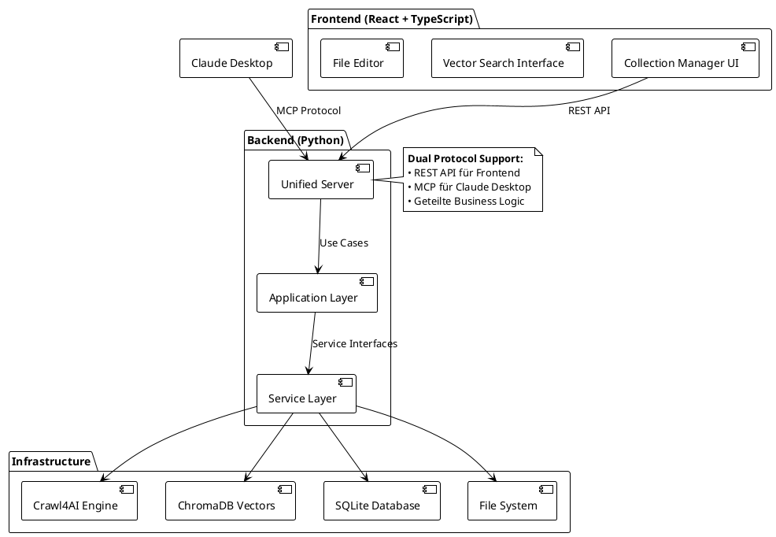

### Kernprinzipien
- **Protokoll-Agnostik**: Business Logic unabhängig von Transport Protocol
- **Clean Architecture**: Klare Schichtentrennung mit Dependency Inversion
- **Dual Protocol Support**: MCP (stdio) + REST API (HTTP) parallel
- **Optional Dependencies**: Graceful Degradation bei fehlenden Features

---

## Frontend Architektur

### Komponent Hierarchie

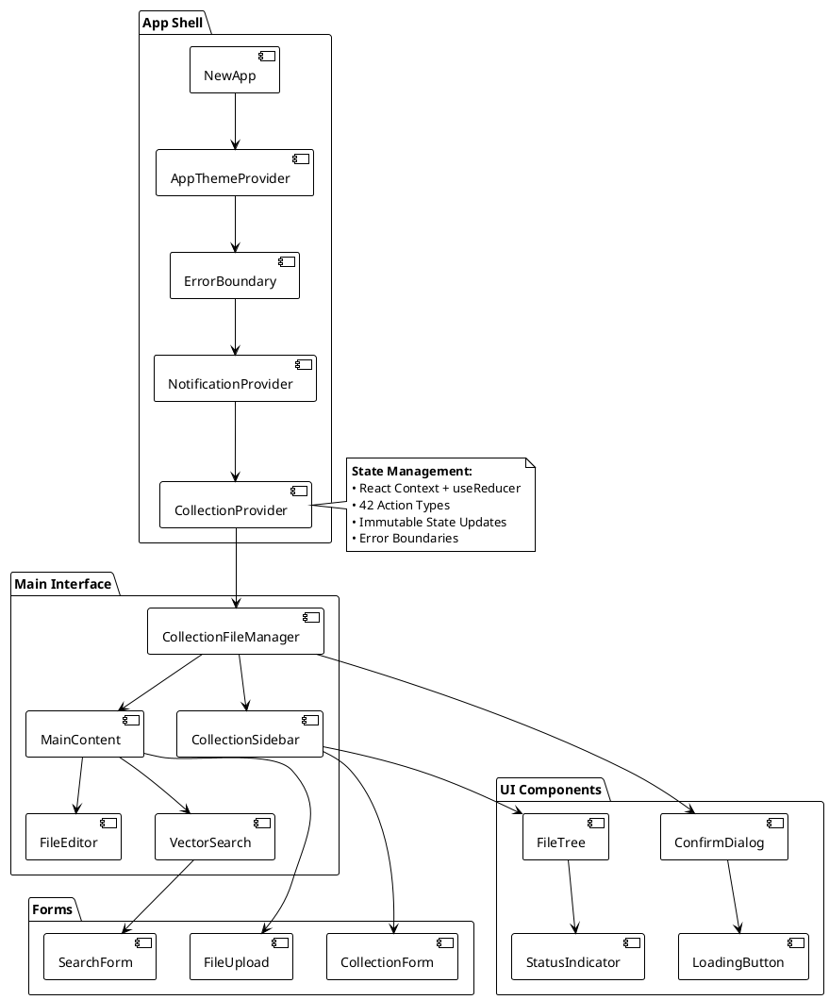

### State Management Architektur

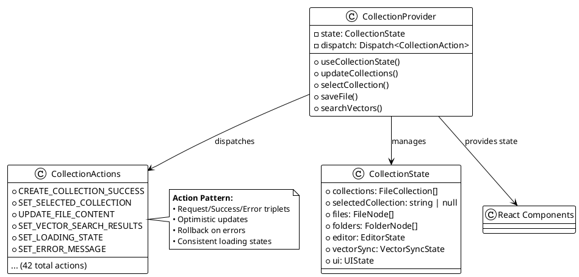

### API Service Layer

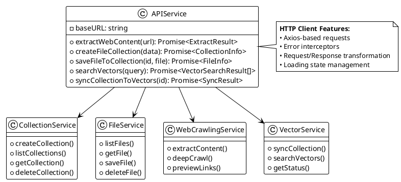

---

## Backend Architektur

### Unified Server Design

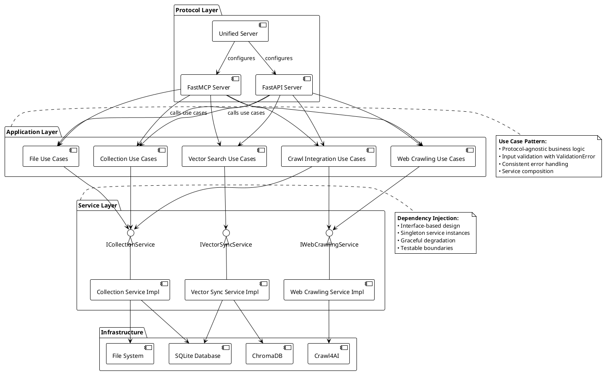

### Use Case Layer Detail

```puml
@startuml Use Case Layer
!theme plain

package "Collection Management" {
  class CollectionUseCases {
    +create_collection_use_case(service, name, description): CollectionInfo
    +list_collections_use_case(service): List[CollectionInfo]
    +get_collection_use_case(service, id): CollectionInfo
    +delete_collection_use_case(service, id): DeleteResult
  }
}

package "File Management" {
  class FileUseCases {
    +list_files_use_case(service, collection_id): List[FileInfo]
    +get_file_use_case(service, collection_id, filename, folder): FileInfo
    +save_file_use_case(service, collection_id, filename, content, folder): FileInfo
    +update_file_use_case(service, collection_id, filename, content, folder): FileInfo
    +delete_file_use_case(service, collection_id, filename, folder): DeleteResult
  }
}

package "Web Crawling" {
  class WebCrawlingUseCases {
    +extract_content_use_case(service, url): CrawlResult
    +deep_crawl_use_case(service, domain_url, config): List[CrawlResult]
    +link_preview_use_case(service, domain_url, include_external): LinkPreview
  }
}

package "Vector Search" {
  class VectorSearchUseCases {
    +sync_collection_use_case(service, name, force_reprocess, chunking_strategy): SyncResult
    +get_sync_status_use_case(service, name): SyncStatus
    +get_all_sync_statuses_use_case(service): Dict[str, SyncStatus]
    +search_vectors_use_case(service, query, collection_name, limit, threshold): List[VectorResult]
    +delete_collection_vectors_use_case(service, name): DeleteResult
  }
}

package "Integration" {
  class IntegrationUseCases {
    +crawl_single_page_to_collection_use_case(web_service, collection_service, name, url, folder): FileInfo
  }
}

class ValidationError {
  +code: string
  +message: string
  +details: dict
}

CollectionUseCases --> ValidationError : raises
FileUseCases --> ValidationError : raises
WebCrawlingUseCases --> ValidationError : raises
VectorSearchUseCases --> ValidationError : raises
IntegrationUseCases --> ValidationError : raises

note bottom of ValidationError
  **Consistent Error Codes:**
  • INVALID_COLLECTION_NAME_TYPE
  • MISSING_URL
  • INVALID_URL_FORMAT
  • CRAWL_FAILED
  • SYNC_FAILED
  • SERVICE_UNAVAILABLE
end note

@enduml
```

### Service Interface Design

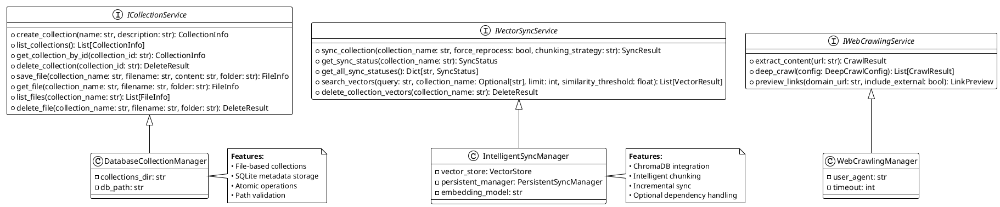

---

## Protokoll Integration

### Dual-Protocol Request Handling

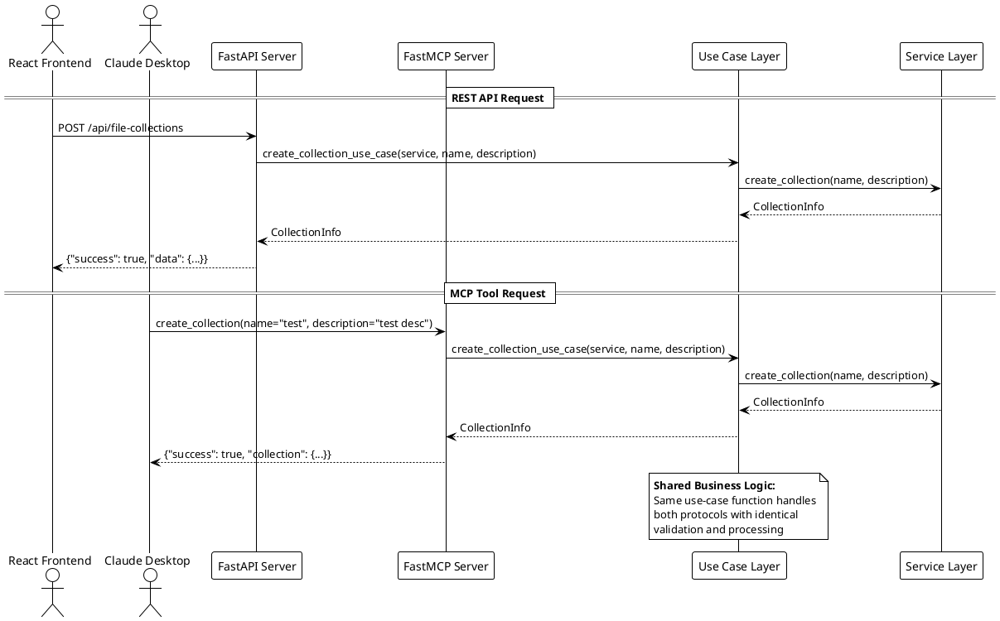

### Error Handling Consistency

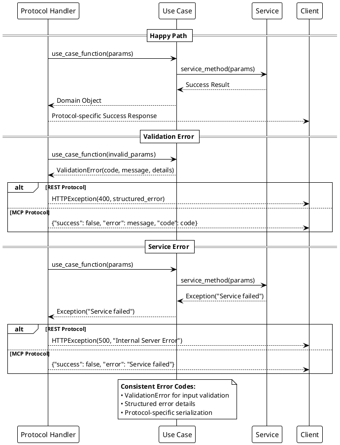

### API Endpoint vs MCP Tool Mapping

| Functionality | REST API Endpoint | MCP Tool | Shared Use Case |
|---------------|-------------------|----------|-----------------|
| **Collections** |
| Create | `POST /api/file-collections` | `create_file_collection` | `create_collection_use_case` |
| List | `GET /api/file-collections` | `list_file_collections` | `list_collections_use_case` |
| Get | `GET /api/file-collections/{id}` | `get_file_collection` | `get_collection_use_case` |
| Delete | `DELETE /api/file-collections/{id}` | `delete_file_collection` | `delete_collection_use_case` |
| **Files** |
| Save | `POST /api/file-collections/{id}/files` | `save_to_collection` | `save_file_use_case` |
| Get | `GET /api/file-collections/{id}/files/{file}` | `read_from_collection` | `get_file_use_case` |
| Update | `PUT /api/file-collections/{id}/files/{file}` | *(use save_to_collection)* | `update_file_use_case` |
| List | `GET /api/file-collections/{id}/files` | *(use get_collection_info)* | `list_files_use_case` |
| **Web Crawling** |
| Extract | `POST /api/extract` | `web_content_extract` | `extract_content_use_case` |
| Deep Crawl | `POST /api/deep-crawl` | `domain_deep_crawl_tool` | `deep_crawl_use_case` |
| Link Preview | `POST /api/link-preview` | `domain_link_preview_tool` | `link_preview_use_case` |
| Crawl to Collection | `POST /api/crawl/single/{id}` | `crawl_single_page_to_collection` | `crawl_single_page_to_collection_use_case` |
| **Vector Search** |
| Sync | `POST /api/vector-sync/collections/{name}/sync` | `sync_collection_to_vectors` | `sync_collection_use_case` |
| Status | `GET /api/vector-sync/collections/{name}/status` | `get_collection_sync_status` | `get_sync_status_use_case` |
| Search | `POST /api/vector-sync/search` | `search_collection_vectors` | `search_vectors_use_case` |

---

## Datenfluss und Workflows

### Web Content Extraction Workflow

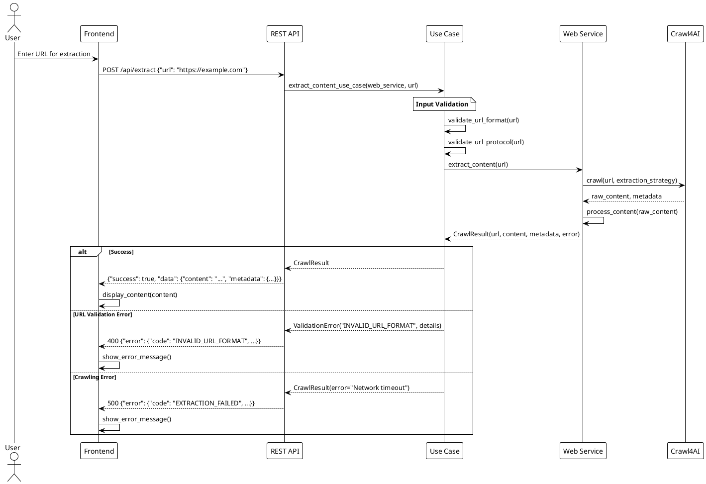

### Collection Management Workflow

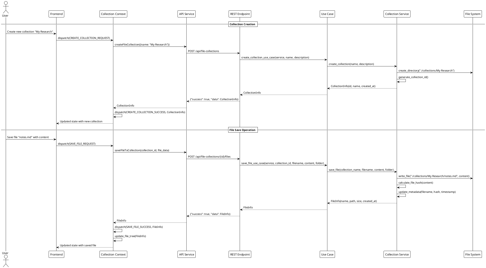

### Vector Search Integration Workflow

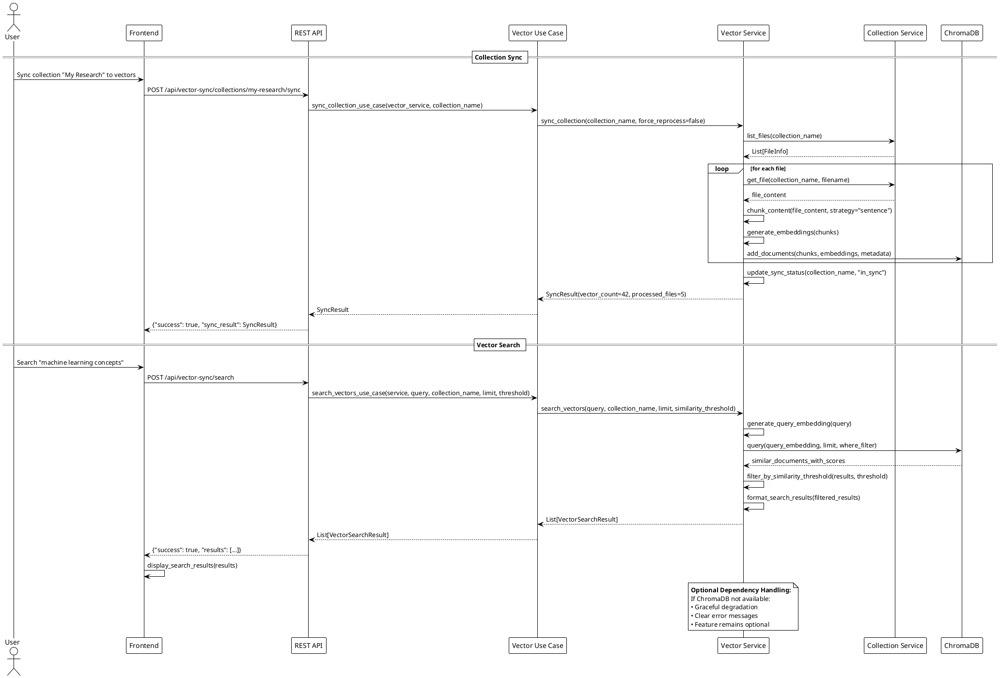

---

## Persistierung

### Datenbank und Speicher Architektur

```puml
@startuml Data Persistence
!theme plain

package "File Collections" {
  [Collections Directory] as CollDir
  [Markdown Files] as MD
  [JSON Files] as JSON
  [Text Files] as TXT
}

package "Metadata Storage" {
  database "SQLite Database" as DB {
    table "file_mappings" {
      * file_path: TEXT
      * file_hash: TEXT  
      * collection_name: TEXT
      * last_modified: TIMESTAMP
      * metadata: JSON
    }
    
    table "sync_statuses" {
      * collection_name: TEXT
      * sync_status: TEXT
      * vector_count: INTEGER
      * last_sync: TIMESTAMP
      * sync_version: INTEGER
    }
  }
}

package "Vector Storage" {
  database "ChromaDB" as Vector {
    collection "crawl4ai_documents" {
      * id: UUID
      * embedding: VECTOR
      * metadata: JSON
      * document: TEXT
    }
  }
}

package "Configuration" {
  [Environment Variables] as ENV
  [CLAUDE.md] as Config
}

CollDir --> DB : "metadata tracking"
MD --> DB : "file hashes"
JSON --> DB : "modification times"
TXT --> DB : "collection mapping"

DB --> Vector : "sync status coordination"
Vector --> DB : "vector count updates"

ENV --> CollDir : "collections_dir path"
ENV --> DB : "database path"  
ENV --> Vector : "vector DB path"
Config --> ENV : "project configuration"

note right of DB
  **SQLite Features:**
  • Atomic transactions
  • File integrity tracking
  • Sync status persistence
  • Metadata indexing
end note

note right of Vector
  **ChromaDB Features:**
  • Semantic embeddings
  • Similarity search
  • Metadata filtering
  • Optional dependency
end note

@enduml
```

### Daten-Modell Relationships

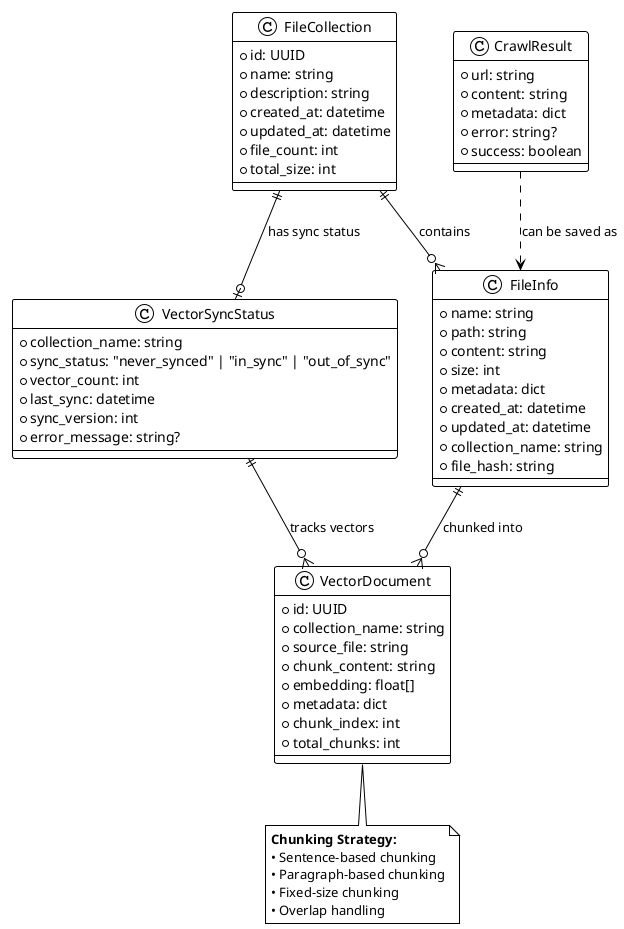

---

## Deployment Architektur

### Entwicklung vs. Produktion

```puml
@startuml Deployment Architecture
!theme plain

package "Development Environment" {
  node "Local Machine" {
    [React Dev Server] as ReactDev
    [Python Unified Server] as PyDev
    [SQLite DB] as DBDev
    [ChromaDB] as VectorDev
    [File System] as FSDev
  }
  
  [Claude Desktop] as ClaudeDev
}

package "Production Environment" {
  node "Server/Container" {
    [Built React App] as ReactProd
    [Python Unified Server] as PyProd
    [SQLite DB] as DBProd
    [ChromaDB] as VectorProd
    [File System] as FSProd
  }
  
  [External Clients] as ClientsProd
}

== Development ==
ClaudeDev -> PyDev : MCP Protocol (stdio)
ReactDev -> PyDev : REST API (http://localhost:8000)

PyDev -> DBDev : SQLite operations
PyDev -> VectorDev : Vector operations
PyDev -> FSDev : File operations

== Production ==
ClientsProd -> ReactProd : Static files
ClientsProd -> PyProd : REST API
[MCP Clients] -> PyProd : MCP Protocol

PyProd -> DBProd : SQLite operations  
PyProd -> VectorProd : Vector operations
PyProd -> FSProd : File operations

note right of PyDev
  **Development Features:**
  • Hot reload
  • Debug logging
  • CORS enabled
  • Concurrent protocols
end note

note right of PyProd
  **Production Features:**
  • Process management
  • Error tracking
  • Performance monitoring
  • Security headers
end note

@enduml
```

### MCP Integration Setup

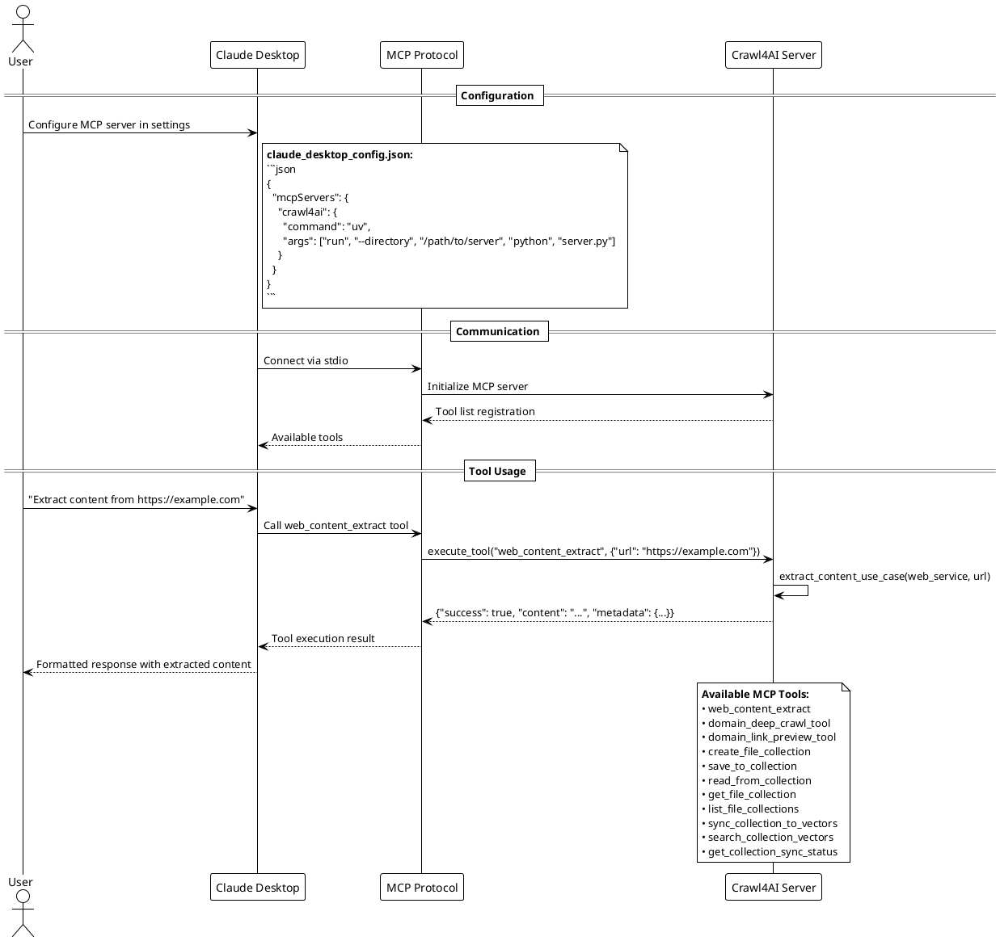

---

## Komponentenkommunikation für bessere Anforderungsanalyse

### Frontend Komponenten Mapping

**Für visuelle Anforderungen verwende diese Komponentennamen:**

| UI Bereich | Komponente | Zweck | Wichtige Props/State |
|------------|------------|--------|---------------------|
| **Hauptlayout** |
| App Shell | `NewApp` | Root-Komponente mit Providern | theme, error boundaries |
| Navigation | `TopNavigation` | Haupt-Navigationsleiste | current route, user actions |
| Sidebar | `CollectionSidebar` | Collections & Dateibaum | selected collection, file tree |
| Content Area | `MainContent` | Hauptbereich für Editor/Search | active view, content type |
| **Collection Management** |
| Collection List | `CollectionList` | Liste aller Collections | collections, loading state |
| Collection Form | `CollectionForm` | Create/Edit Collection Dialog | form data, validation |
| File Tree | `FileTree` | Hierarchische Dateiansicht | files, folders, selection |
| **File Operations** |
| File Editor | `FileEditor` | Monaco-Editor für Dateien | content, language, save state |
| File Upload | `FileUpload` | Drag & Drop Upload | files, progress, validation |
| File Actions | `FileActions` | Rename/Delete/Download | file info, permissions |
| **Search & Vectors** |
| Vector Search | `VectorSearch` | Semantic Search Interface | query, results, filters |
| Search Results | `SearchResults` | Search Result Display | results, pagination, sorting |
| Sync Status | `SyncStatus` | Vector Sync Status Indicator | sync state, progress, errors |
| **Web Crawling** |
| URL Input | `URLInput` | URL Eingabe für Crawling | url, validation, submit |
| Crawl Progress | `CrawlProgress` | Crawling Fortschritt | status, progress, results |
| Link Preview | `LinkPreview` | Preview verfügbarer Links | links, selection, filtering |

### Backend Service/Use-Case Mapping

**Für Backend-Anforderungen verwende diese Service-/Use-Case-Namen:**

| Funktionalität | Use-Case Funktion | Service Methode | API Endpoint |
|----------------|-------------------|-----------------|--------------|
| **Collection Management** |
| Collection erstellen | `create_collection_use_case` | `CollectionService.create_collection` | `POST /api/file-collections` |
| Collections auflisten | `list_collections_use_case` | `CollectionService.list_collections` | `GET /api/file-collections` |
| Collection abrufen | `get_collection_use_case` | `CollectionService.get_collection_by_id` | `GET /api/file-collections/{id}` |
| Collection löschen | `delete_collection_use_case` | `CollectionService.delete_collection` | `DELETE /api/file-collections/{id}` |
| **File Management** |
| Datei speichern | `save_file_use_case` | `CollectionService.save_file` | `POST /api/file-collections/{id}/files` |
| Datei abrufen | `get_file_use_case` | `CollectionService.get_file` | `GET /api/file-collections/{id}/files/{name}` |
| Dateien auflisten | `list_files_use_case` | `CollectionService.list_files` | `GET /api/file-collections/{id}/files` |
| Datei löschen | `delete_file_use_case` | `CollectionService.delete_file` | `DELETE /api/file-collections/{id}/files/{name}` |
| **Web Crawling** |
| Content extrahieren | `extract_content_use_case` | `WebCrawlingService.extract_content` | `POST /api/extract` |
| Deep Crawling | `deep_crawl_use_case` | `WebCrawlingService.deep_crawl` | `POST /api/deep-crawl` |
| Links vorschau | `link_preview_use_case` | `WebCrawlingService.preview_links` | `POST /api/link-preview` |
| **Vector Operations** |
| Collection synchronisieren | `sync_collection_use_case` | `VectorSyncService.sync_collection` | `POST /api/vector-sync/collections/{name}/sync` |
| Sync Status abrufen | `get_sync_status_use_case` | `VectorSyncService.get_sync_status` | `GET /api/vector-sync/collections/{name}/status` |
| Vektoren durchsuchen | `search_vectors_use_case` | `VectorSyncService.search_vectors` | `POST /api/vector-sync/search` |

### Persistierung Layers

**Für Daten-/Persistierungsanforderungen:**

| Datentyp | Storage Layer | Technologie | Zuständigkeit |
|----------|---------------|-------------|---------------|
| **File Collections** | `DatabaseCollectionManager` | File System + SQLite | Collection CRUD, File Storage |
| **Vector Embeddings** | `IntelligentSyncManager` | ChromaDB | Semantic Search, Embeddings |
| **Sync Metadata** | `PersistentSyncManager` | SQLite | Sync Status, File Mappings |
| **Crawling Results** | `WebCrawlingManager` | Temporary + File System | Content Extraction, URL Processing |

---

### Beispiel: Wie Anforderungen formuliert werden sollten

**❌ Unpräzise Anforderung:**
> "Die Search Funktion soll besser werden"

**✅ Präzise Anforderung mit Architektur-Kontext:**
> "Die `VectorSearch` Komponente im Frontend soll erweitert werden: Der `search_vectors_use_case` soll zusätzliche Filter-Parameter unterstützen (Zeitraum, Dateityp). Das `VectorSyncService.search_vectors` Interface muss entsprechend erweitert werden, und die ChromaDB-Abfrage in `IntelligentSyncManager` soll Metadata-Filter verwenden."

**❌ Vage Änderungsanfrage:**
> "File Upload funktioniert nicht richtig"

**✅ Spezifische Problemanalyse:**
> "Die `FileUpload` Komponente im `MainContent` Bereich hat ein Problem beim Aufruf von `save_file_use_case`. Der `CollectionService.save_file` in der Service Layer wirft wahrscheinlich einen Validierungsfehler, der nicht korrekt in der `CollectionContext` State Management abgefangen wird."

Diese Architektur-Dokumentation ermöglicht es dir, präzise zu kommunizieren welche Teile des Systems geändert werden sollen, und mir dabei zu helfen, Duplikationen und Inkonsistenzen wie bei der MCP/API-Logik frühzeitig zu erkennen.